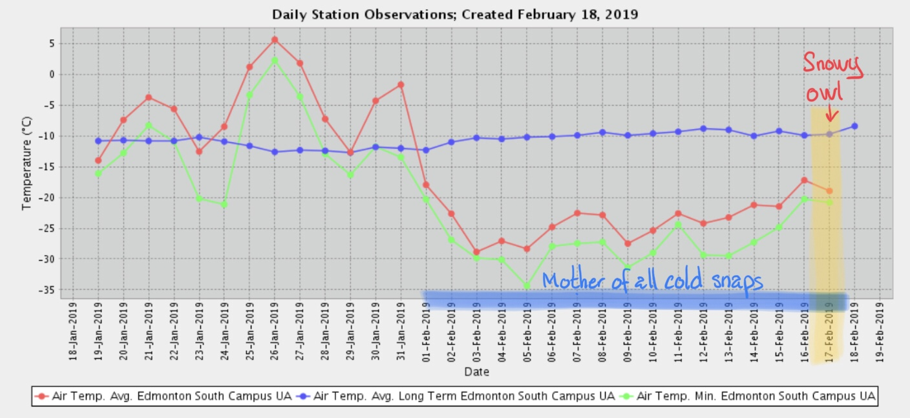
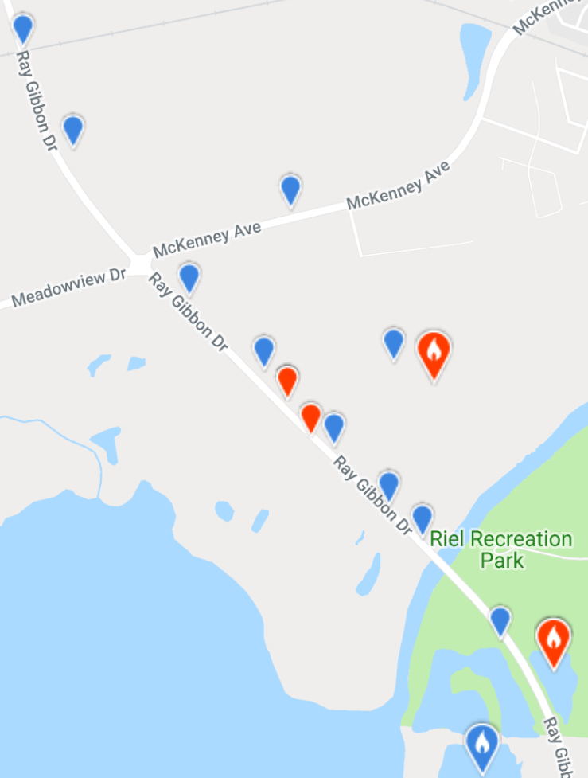
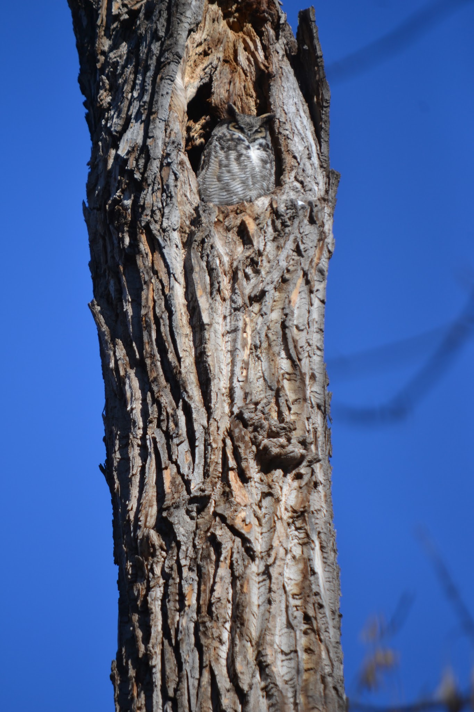
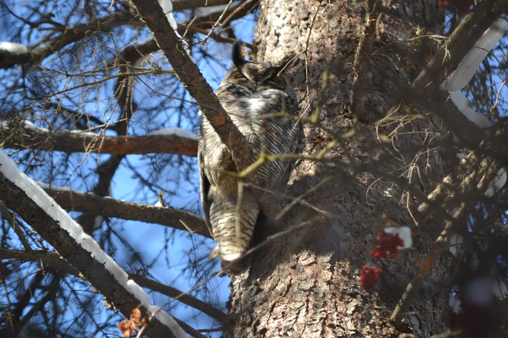

This year's Family Day weekend coincided with the [Great Backyard Bird Count](https://www.birdscanada.org/volunteer/gbbc/) so obviously this called for heading out into the wild for some birding with family and friends. For the past three weeks, however, Alberta has been under, what appears to be, an unbreakable cold spell. The normal seasonal temperature this time of year in Edmonton is around -10 °C, but all through February temperatures have hovered around -30 °C..., and that is without taking the windchill into account. With the windchill, night temperatures have dropped down to between -30 °C to -40 °C. Needless to say, birding has been put on the back burner during this cold spell.

The current cold snap is almost in on its third week. The wind chills often push the temperature down another 10 °C to 15 °C.  

After three weeks of increasing cabin fever, it was decided, it was time to brave the deep freeze and head out in the frozen wilds. We ended up doing two excursions over the weekend, one to Ray Gibbon Drive in St. Albert in search of our first Snowy Owl and a second to the Whitemud Creek for some general winter bird awesomeness.

Ray Gibbon Drive is a major thoroughfare with lots of traffic and I would have never expected for such a large owl to be hanging out in plain daylight in such a busy and mundane location. We had, however, received reliable intel from a fellow birder that Snowy Owls can often be seen perching on the light and utility poles along the road. So it was with anticipation and mounting excitement we headed north to Ray Gibbon Drive on Sunday. The heavy traffic and the lack of shoulders do not allow a car to stop so our strategy was simple. Drive as slowly as possible, but not so slow that drivers behind us would lose their cool (which would be indicated by honking and visible fists in our rear mirrors)..., while systematically scanning the roadside for owls. We figured that at a slow enough speed and with three pairs of eyeballs it would be difficult for an owl to go unnoticed. If we did not spot an owl on the first pass, we would drive to the end of the road, turn around and do another pass..., and repeat as long as necessary. As it turned out, luck was on our side. On our first pass, we spotted a large “poofy” organic-looking mass on the cross arm of a wooden utility pole. We decided to try to get a better view, so we pulled off the main road, parked at a gravel road and ventured into the Grey Nuns Spruce Woodlot. The good news is that after a bit of a hike we were able to get a clear view of the owl from a distance. The not so good news is that the cold got the better of us and we had to cut the birding short and as we do not have a camera yet we were not able to get a picture of the owl. The specimen was a large white snowy owl that looked completely at ease on its perch, despite the heavy traffic close by.

This sighting is special for us. Not only is it a lifer for all three of us but it is also our very first owl! One cannot help but be in awe of such a magnificent bird on a blisteringly cold winter day such as this, particularly when you consider that they migrate south to Edmonton to overwinter.

Reported Snowy Owl sightings along Ray Gibbon Dr between December 2018 and February 2019. Yup - the owls are definitely there!

The following day we ventured to Whitemud Creek. Over 150 species of birds have been identified along this creek, making it somewhat of a birding hotspot due to the riparian habitat and abundance of old growth forest with dead standing trees. Despite the biting cold we saw all the regular inhabitants of the area, from the bold and chatty Black-capped Chickadees demanding sunflower seeds, the odd White-breasted Nuthatch to a timid Downy Woodpecker and a splendid Pileated Woodpecker that could not care less about us ogling him as he was working away on a tree stump with such ferocity woodchips were whirling around him like there was no tomorrow. The highlight, however, was undoubtedly the Great Horned Owl pair we found, with the female snuggled up in a large cavity in a dead tree and the male hiding among the low-level branches of a nearby spruce tree. The pair, silent and perfectly camouflaged blended in with the bark of the trees. How did we find them? We just followed the throng of primates carrying cameras with large telephoto lenses. It turns out that the owl pair is a bit of celebrity for people that regularly visit the creek.

Female Great Horned Owl in her abode. Image: Patricia S.

Male Great Horned Owl, presumably the partner of the female in a nearby tree. Image: Patricia S.

All in all, the weekend's birding did not become memorable for the sheer number of species but rather for the two iconic and majestic owls that both were lifers as well as our first two owl species. With the addition of these two owls, our Alberta Big Year tally is now at 40 species. Here is the full tally of our sightings for these two days.

St. Albert--Ray Gibbon (Riel East Pond), Edmonton, Alberta, CA  
Feb 17, 2019 4:48 PM - 5:33 PM  
Protocol: Stationary  
1 species  
  
Snowy Owl (Bubo scandiacus)  1     Large individual sitting on top of a wooden power post with feathers fluffed and just chilling. Beautiful sunny day, -17C, slight breeze and -24C with the windchill.   

Edmonton--Whitemud Park, Edmonton, Alberta, CA  
Feb 18, 2019 1:00 PM - 2:30 PM  
Protocol: Traveling  
3.0 kilometer(s)  
Comments:     Beautiful sunny winter day, -14C (-20C with windchill).   
7 species  
  
Great Horned Owl (Bubo virginianus)  2  
Downy Woodpecker (Dryobates pubescens)  1  
Pileated Woodpecker (Dryocopus pileatus)  1  
Northern Flicker (Colaptes auratus)  2  
Common Raven (Corvus corax)  1  
Black-capped Chickadee (Poecile atricapillus)  40  
White-breasted Nuthatch (Sitta carolinensis)  4

_May the curiosity be with you. This is from "The Birds are Calling" blog (www.thebirdsarecalling)._
