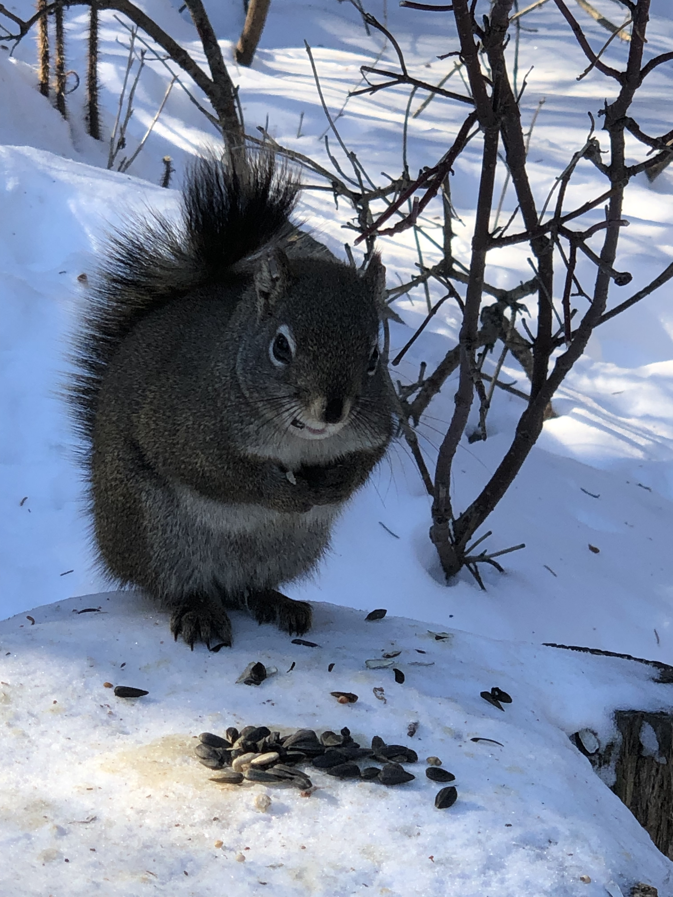
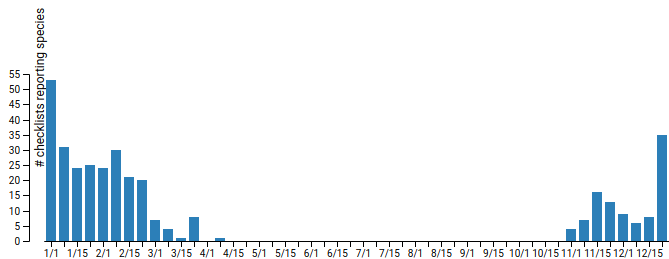

Today's excursion, first one in March, happened to coincide with the [World Wildlife Day](https://www.wildlifeday.org/) (March 3). It was a beautiful sunny winter day with temperatures reaching a "balmy" -15 °C (-19 °C with the wind chill). Living in sub -30 °C range for a month changes one's perspective on what constitutes cold weather. Anyone not having lived through these extreme temperatures for any length of time would likely and perhaps rightfully consider us a bit "nuts". It is remarkable, however, that no matter how cold it gets, the birds are always out and active; with the exception of the owls, which just seem to "chill" (pun intended). Perhaps extremely low temperatures require birds to keep foraging in order to stay warm and to maintain their metabolism throughout the night.

Today we went for a 4 km walk along the Whitemud Creek Ravine (south of Snow Valley this time), our local winter bird hotspot. While we did not break any birding records it was well worth spending some time outside with the usual suspects; the Black-capped Chickadees demanding sunflower seeds, a Pileated Woodpecker going to town on an old tree, a very energetic Downy Woodpecker making a racket that seemed entirely disproportionate to its diminutive size, a Raven soaring silently overhead and a White-breasted Nuthatch snatching a sunflower seed before the chickadees found it. Lots of Red Squirrels were out as well looking for a morsel to eat.

A Red Squirrel taking advantage of the sunflower handouts. Picture by Vero M.

After accosting us for sunflower seeds, this Black-capped chickadee got its demands met. Picture by Vero M.

The eBird record for today's excursion:

Edmonton--Whitemud Creek, S of Snowvalley, Edmonton, Alberta, CA  
3-Mar-2019 12:04 PM - 1:33 PM  
Protocol: Traveling  
3.976 kilometer(s)  
Comments:     Beautiful sunny winter day, -15C (-19C with wind chill).   
5 species  
  
Downy Woodpecker (Dryobates pubescens)  1  
Pileated Woodpecker (Dryocopus pileatus)  1  
Common Raven (Corvus corax)  1  
Black-capped Chickadee (Poecile atricapillus)  10  
White-breasted Nuthatch (Sitta carolinensis)  1  

As of end of February we have seen 40 species of birds in Alberta. While the winter may be a slow time for birding, the final count for the greater Edmonton area winter bird count was finalised by the Edmonton Nature Club on March 1. Between December and February total of 91 species of birds were observed in a 160 km diameter circle centred on Edmonton (West/east boundaries are roughly Seba Beach and Ryley and the north/south boundaries are roughly Westlock and Wetaskiwin). This is the highest number of species observe since the count started 7 years ago. This year there were several notable additions (e.g. Eared Grebe, Great Blue Heron, Hermit Thrush and Brewer's Blackbird). A total of 119 species were observed over the last 7 years. This just shows that, despite the long harsh winter, there is a remarkably large number of species present in and around Edmonton during this time of year.

Although we have had a somewhat slow start to our AB Big Year, most of these species will be present throughout the year giving us opportunities to bag them later. Some species, however, only occurs in the Edmonton area during the winter, for example Snowy Owls (which we did see a few weeks ago), Snow Bunting (not seen), Common Redpoll (seen), Hoary Redpoll (not seen), Pine Grosbeak (not seen), Brown Creeper (seen) and Northern Shrike (not seen) just to mention a few. Since we are "lucky enough" to have winter weather for more-or-less half the year (Oct to March on a typical year), we still have a few weeks to track down these winter visitors.

Number of check lists reporting Snowy Owl sightings in the Edmonton area over the last five years by time of year clearly showing that Snowy Owl sightings only occur between November and March.

I find myself still thinking of the poor Great Blue Heron that was found in Hermitage Park at the beginning of February (during the extreme cold spell). There was a discussion thread on the Edmonton Nature Club's bulletin board that tracked the heron's deteriorating condition and then it just vanished. It appears that this individual was at the wrong place at the wrong time of the year and it is unlikely this story had a happy ending. While many species seem to do well in our harsh winter environment, there is a fine line between survival and death when environmental conditions are at their extreme.

Here is the complete list by Edmonton Nature Club of species seen during the winter count 2018/19 in the greater Edmonton area:

- Trumpeter Swan
- Tundra Swan
- Great Blue Heron
- Red-necked Grebe
- Western Grebe
- Horned Grebe
- Eared Grebe
- Canada Goose  
- Mallard
- Gadwall
- Northern Pintail
- American Wigeon
- Green-winged Teal
- Canvasback
- Redhead
- Ring-necked Duck
- Greater Scaup
- Lesser Scaup
- Common Goldeneye
- Barrows Goldeneye
- Bufflehead
- Hooded Merganser
- Common Merganser
- Red-breasted Merganser
- Ruddy Duck
- Sharp-shinned Hawk
- Cooper's Hawk
- Northern Goshawk
- Rough-legged Hawk
- Golden Eagle
- Bald Eagle
- Merlin
- Prairie Falcon
- Gyrfalcon
- Peregrine Falcon
- Gray Partridge
- Ring-necked Pheasant
- Ruffed Grouse
- American Coot
- Eurasian-Collared Dove
- Rock Pigeon
- Great Horned Owl
- Snowy Owl
- Great Gray Owl
- Barred Owl
- Northern Saw-whet Owl
- Northern Hawk Owl
- Downy Woodpecker
- Hairy Woodpecker
- American Three-toed Woodpecker
- Black-backed Woodpecker
- Northern  Flicker
- Pileated Woodpecker
- Northern Shrike
- Blue Jay
- Canada Jay
- Black-billed Magpie
- Common Raven
- American Crow
- Black-capped Chickadee
- Boreal Chickadee
- Red-breasted Nuthatch
- White-breasted Nuthatch
- Brown Creeper
- Golden-crowned Kinglet
- Townsend's Solitaire
- Hermit Thrush
- Varied Thrush
- American Robin
- European Starling
- Bohemian Waxwing
- Cedar Waxwing
- Yellow-rumped Warbler
- Northern Cardinal
- American Tree Sparrow
- White-throated Sparrow
- Song Sparrow
- Dark-eyed Junco
- Snow Bunting
- Common Grackle
- Evening Grosbeak
- Pine Grosbeak
- Brewer's Blackbird
- House Finch
- Red Crossbill
- White-winged Crossbill
- Common Redpoll
- Hoary Redpoll
- Pine Siskin
- American Goldfinch
- House Sparrow

_May the curiosity be with you. This is from “The Birds are Calling” blog (www.thebirdsarecalling)._
