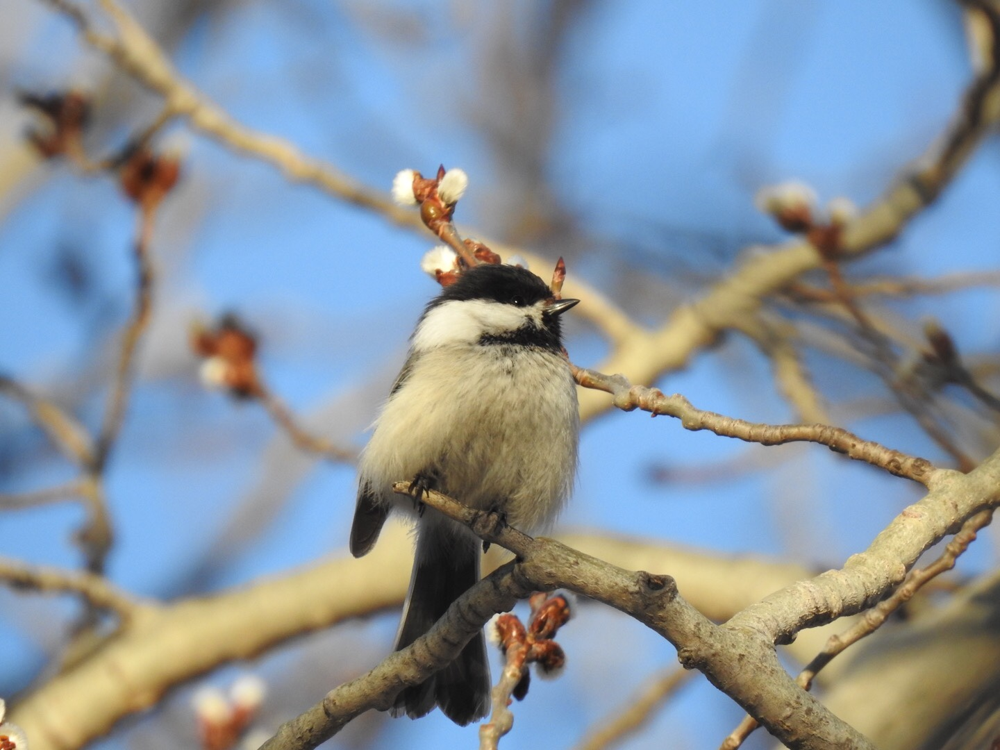

Today is the first day of spring and all the signs are here; the creeks and rivers are largely ice-free, the beavers at the Whitemud Creek have awoken from their winter hibernation and the buds are bursting.

During my nature walk along the Whitemud Creek the other day the beavers were out in full force, swimming around in the slurry waters, breaking through ice floes like fury little ice breakers and chilling on the banks with their friend, the muskrat. The onset of the seasonal changes is sudden and things are changing fast. Just a week ago my son and I walked on the frozen creek, meeting people on skis and walking their dogs. Today the creek is virtually ice free. I am super-excited about the upcoming return of the migratory birds, but a bit sad that I have to bid farewell to the Snowy Owls.

\[caption id="attachment\_413" align="alignnone" width="1440"\] The buds are bursting. Photo: Mario Pineda.\[/caption\]

Officially Spring arrives at 3:58pm today (Spring Equinox). It is a sunny day, not a cloud in the sky and +11 °C. What better way to greet spring and all the the excitement it will bring about in nature than heading down to the creek. We will head down for a first spring nature walk as soon as work and school is out.

\[caption id="attachment\_405" align="alignnone" width="5184"\] Muskrat (Ondatra zibethicus) doing a very thorough spring grooming. Photo: Mario Pineda.\[/caption\]

\[caption id="attachment\_406" align="alignnone" width="5184"\] North American Beavers (Castor canadensis) basking on the banks of Whitemud Creek. Photo: Mario Pineda.\[/caption\]

\[caption id="attachment\_408" align="alignnone" width="5184"\] Beaver on ice. Photo: Mario Pineda.\[/caption\]

\[caption id="attachment\_410" align="alignnone" width="5184"\] Canadian-style fury icebreaker. Photo: Mario Pineda.\[/caption\]

_May the curiosity be with you. This is from “The Birds are Calling” blog (www.thebirdsarecalling)._
