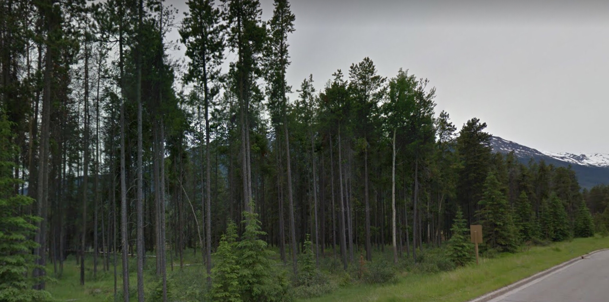
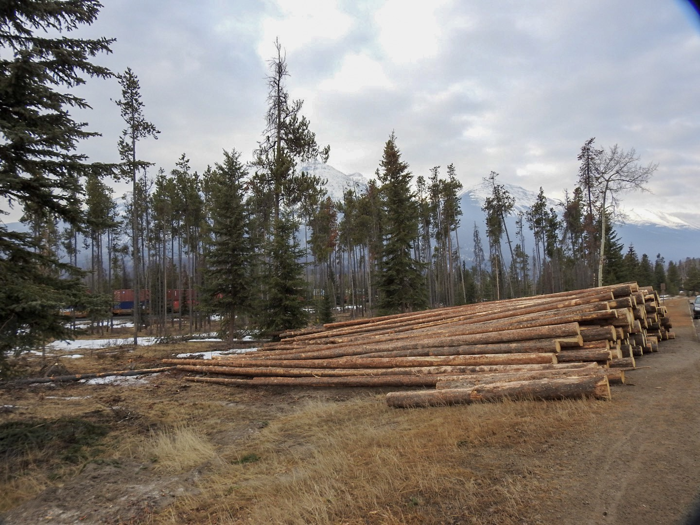
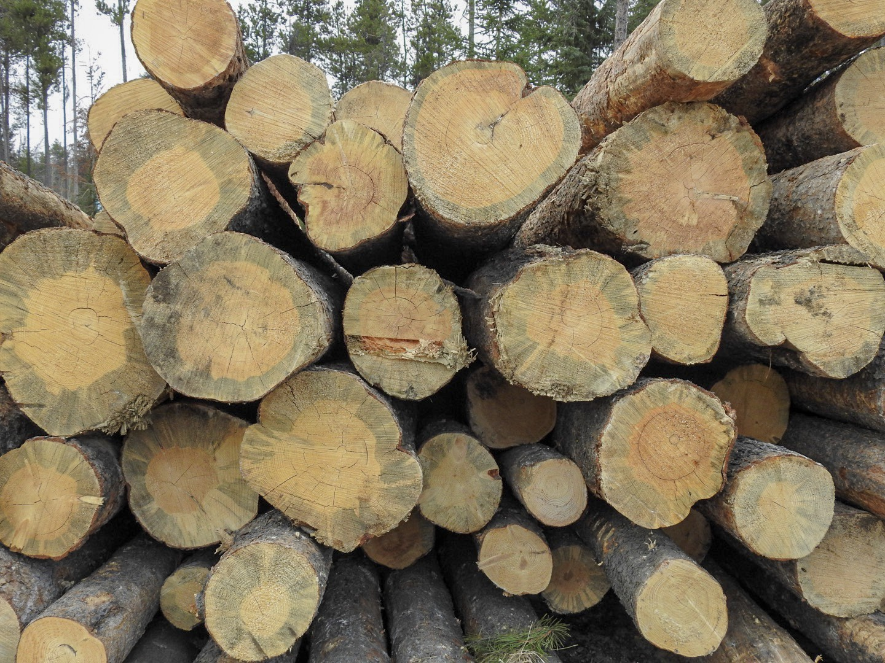
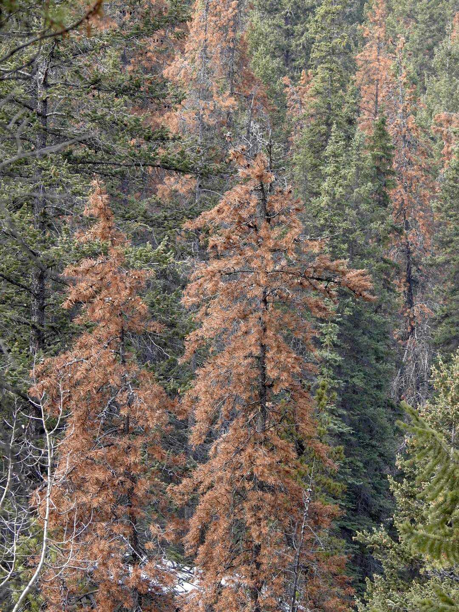
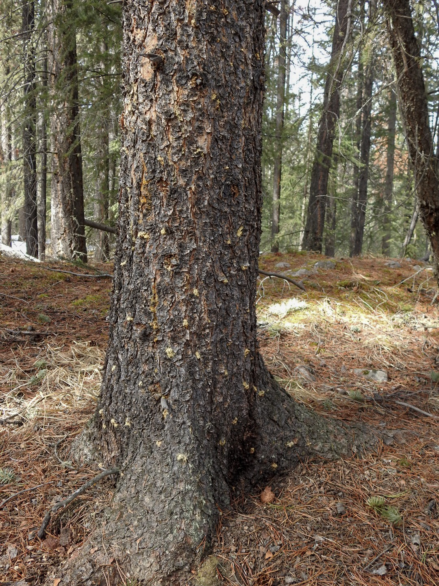
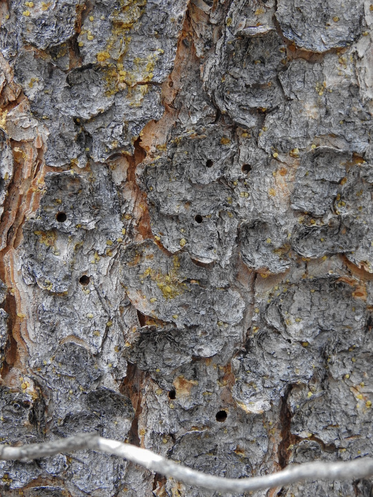
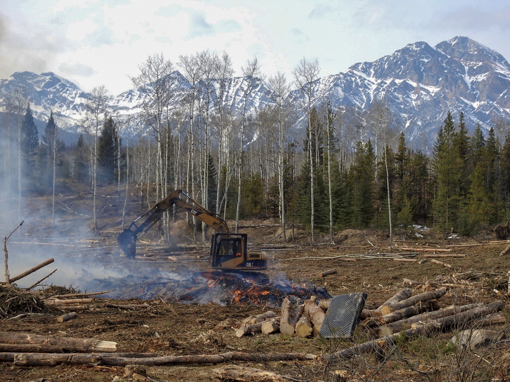
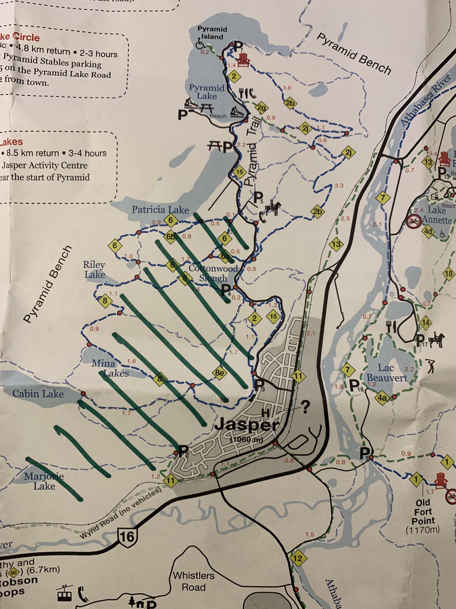

Spring break is here and there is not time to waste. Right after school on Friday afternoon we hit the road and went to Jasper for the weekend. Other than skiing at Marmot Basin we had no plans other than enjoying the mountains. We have been to Jasper many times before, but this time a distinctly different scenery greeted us when we arrived. The smoke of burning wood hung heavy in the air and stacks of lumber were piled up high throughout Jasper. Anyone who has been to Jasper over the last few years could not have missed the signs. Over the last few years more and more trees around Jasper (and throughout the National Park) have been turning rust coloured as they succumbed and died to an almost invisible foe - the Mountain Pine Beetle. No larger than a grain of rice this beetle has decimated the pine forests of British Columbia over the last decades. Slowly but surely it has advanced East-wards until it crossed the Rocky Mountains and invaded Alberta.

We go to Jasper every year and every time more of the pine forests has turned a rusty brown colour. With this many standing dead trees fire hazard becomes a serious concern. To prevent a wildfire in the proximity of the town-site, last fall infested stands were logged and remove or burned.

As one enters Jasper from the highway (west side of town) along Connaugh Drive, one used to be greeted by a lush green forest along the roadside.

Not anymore. Now the view from Connaugh Drive is dramatically different.

A closer look at the tree trunks reveals the characteristic blue staining of the wood due to a fungus that is introduced into the tree by the Mountain Pine Beetle. If recovered in time this wood is structurally sound and can still be used for lumber. It would be interesting to know what the plans for this lumber are.

When pines are infested by Mountain Pine Beetles they turn a rusty colour as they die. The rust color fades to a grey color after a few years creating stands of ghost-like forests.

This trunk of a pine trees exhibits the characteristic pitch tubes of a Mountain Pine Beetle attack. As the beetles drill into the tree, the tree defends itself by extruding sap which then form yellow clumps on the outside of the bark.

The lack of sap around these holes suggests that these may be exit holes for the offspring of the beetles that initially attacked this tree. By the time the offspring emerge (the following year) the tree is already dead and does not have the sap anymore. Once the offspring emerge they set out to find new hosts and mates to continue the cycle.

Clear cutting and burning of infested stands by Patricia Lake north of the town-site.

The removal of the infested trees around Jasper started last October, once the ground was frozen to minimize damage from the heavy machinery. The green hatched area on the map indicates the where trees are being removed.

The pine forest will undoubtedly recover, but it will take time and in the meantime there will be some major changes to the flora and fauna of the affected regions. I suspect that once the vegetation starts to colonize the newly formed large open areas we will likely see more brush-like vegetation and perhaps more wildflowers as well. Obviously anywhere where the dead trees are left (which is pretty much everywhere) there will likely also be an increase in wildfires.

_May the curiosity be with you. This is from “The Birds are Calling” blog ([www.thebirdsarecalling](http://www.thebirdsarecalling)). Copyright Mario Pineda._
