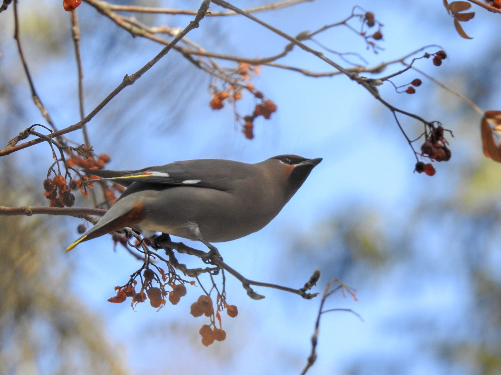

What is Project 366? Read more [here](https://thebirdsarecalling.com/2019/03/29/project-366/)!

Bohemian Waxwings like to hang out in fruit tree. They are frugivores with an attitude. They can be found roaming around in large groups, descending on fruit trees and engaging in noisy fruit eating feasts before moving on. Over the last few weeks we have been seeing Bohemian Waxwings regularly in the Whitemud Ravine. They are handsome birds with facial markings resembling the makeup of a Chinese opera performer, wingtips with distinct bright yellow, white and red markings, dark orange under tail feathers and bright yellow tail tip. You can never have enough Bohemian Waxwings in your life.

_May the curiosity be with you. This is from “The Birds are Calling” blog ([www.thebirdsarecalling](http://www.thebirdsarecalling)). Copyright Mario Pineda._
