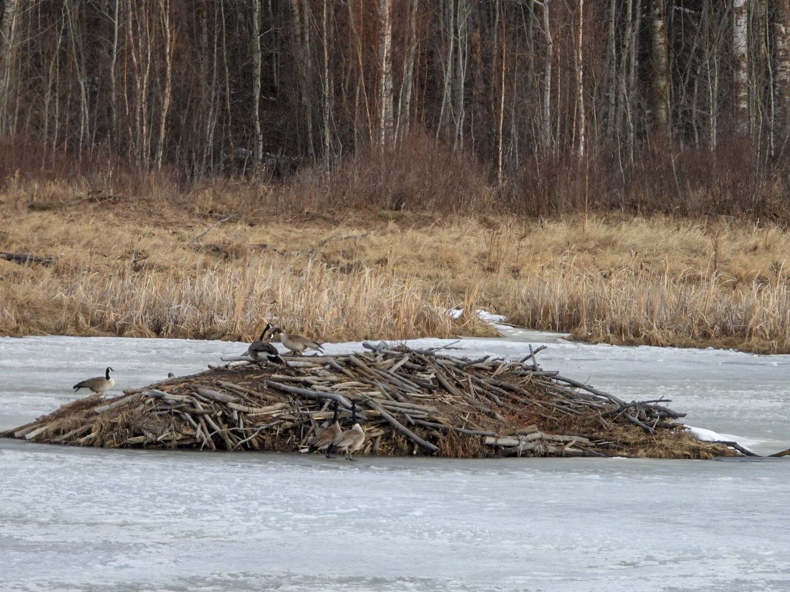

What is Project 366? Read more [here](https://thebirdsarecalling.com/2019/03/29/project-366/)!

The Canada Geese are back and with that, spring migration is slowly getting started. I spend the morning at Elk Island National Park and came across, what must be one of the most iconic Canadian sights, a bunch of Canada Geese making a racket on top of a beaver dam in a frozen lake. No sight of beavers though. I imagine, however, that the occupants of the dam must have been royally annoyed by being awoken so rudely by the geese. Not far away, I spotted a band of European Starlings chattering away in a tree. The starlings became species 42 on my Alberta Big Year list. It may be a slow start to spring but from now on it can only get better as the pace of the returning migrants quickens. There is much too look forward to as our familiar birding spots are about to get transformed. The bison were also out in full force, both the Plains and the Wood bison. I also saw some deer and a fleeting shadow at a forest edge in the distance eerily reminiscent of a moose, but maybe it was just an optical illusion combined with wishful thinking.

_May the curiosity be with you. This is from “The Birds are Calling” blog ([www.thebirdsarecalling](http://www.thebirdsarecalling)). Copyright Mario Pineda._
