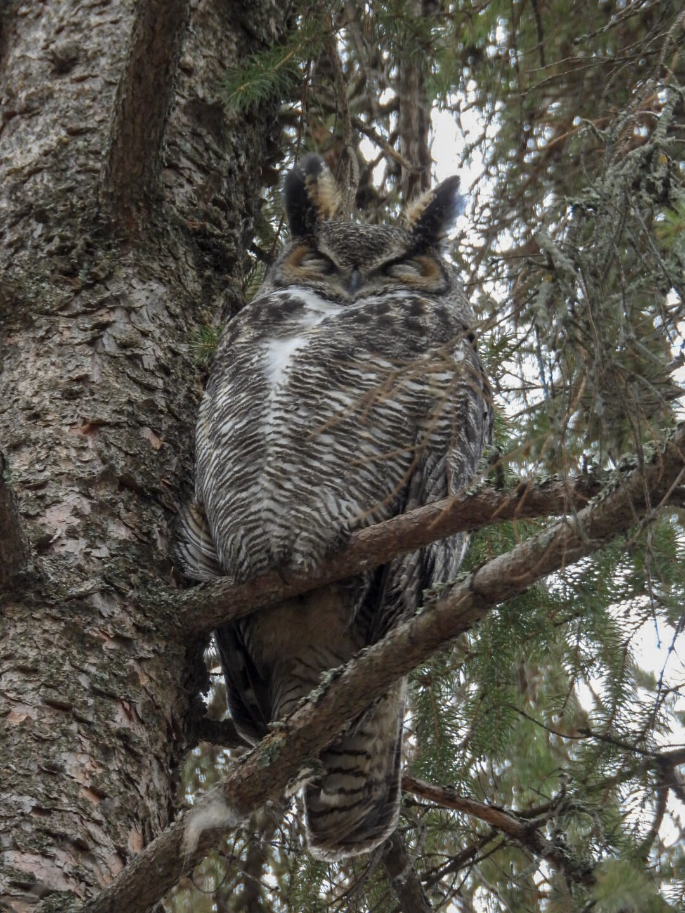

What is Project 366? Read more [here](https://thebirdsarecalling.com/2019/03/29/project-366/)!

If you spend any time down in the Whitemud Ravine, whether you are a birder, dog walker or fitness buff, you soon realize that someone is hiding high up in the trees along the trail. It’s an expecting pair of Great Horned Owls. They are discrete and quiet with the female hiding in a large tree cavity while sitting on eggs and the male, always close by, hiding among the branches high up in a nearby tree. You could easily walk by them not realizing they are there. The only reason one cannot miss them is because of all the photographers hanging out by their nesting site. These owls are truly a celebrity couple with paparazzis-style nature photographers and nature buffs breathlessly watching their every move and counting the days the female has been sitting on the eggs. Apparently today is day 23. Great Horned Owls incubate their eggs for about 30-37 days which would give a predicted hatch date somewhere between April 8 and April 15. With the Whitemud Ravine being the closest birding hotspot for us, we typically head down to the creek several times a week. It is always exciting, refreshing and suspenseful as you never know what you see or who you bump into, birds, animals or fellow nature buffs. On our walk yesterday I managed to snap the following picture of the male. He seemed tired and could not care less about the photographers below the tree. For a moment a feisty Black-capped Chickadee tried to get his attention, but he dismissed the diminutive critter like it would be nothing more than a buzzing mosquito. The chickadee deserves our respect though. It takes some big cojones for someone that small to pick a fight with someone that much larger with those formidable talons and beak.

_May the curiosity be with you. This is from “The Birds are Calling” blog ([www.thebirdsarecalling](http://www.thebirdsarecalling)). Copyright Mario Pineda._
