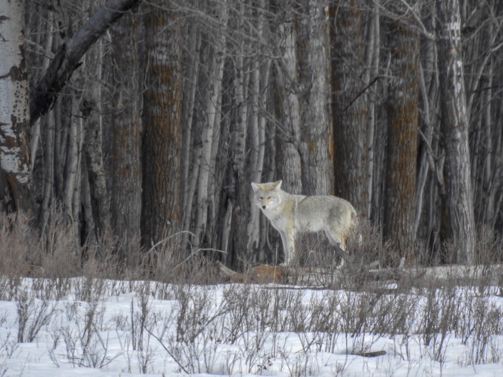

What is Project 366? Read more [here](https://thebirdsarecalling.com/2019/03/29/project-366/)!

Coyotes sometimes get a bad rep. Any creature, however, that survives the long dark cold Canadian winter and comes out at the other end looking this handsome and chilled deserves our respect. We spotted this beautiful Coyote at the Bison Loop at Elk Island National Park last week. He was pacing back and forth at the edge of the forest and seemed just a curious about us as we were about him. Just by happenstance, at 6 am the next morning smack dab in the middle of Edmonton I found two coyotes in front of our house. They were probably looking for a cat for breakfast and took off as soon as they spotted me.

_May the curiosity be with you. This is from “The Birds are Calling” blog ([www.thebirdsarecalling](http://www.thebirdsarecalling)). Copyright Mario Pineda._
