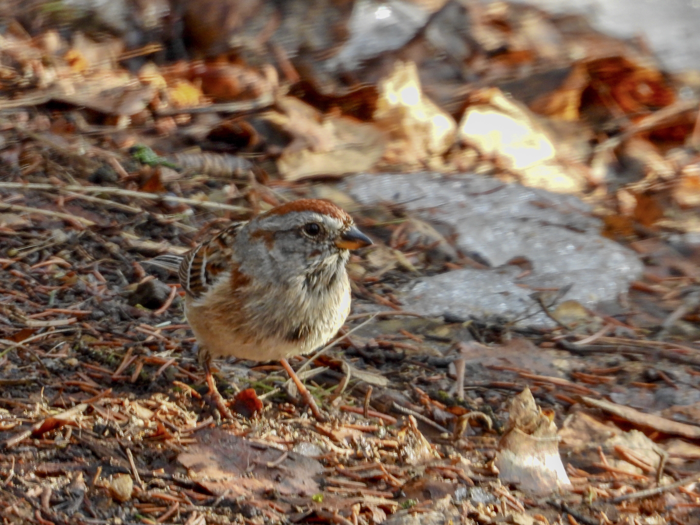

What is Project 366? Read more [here](https://thebirdsarecalling.com/2019/03/29/project-366/)!

Yesterday my son and I went for a nature walk at the Whitemud Ravine. We quickly encountered the usual suspects. The Black-Capped Chickadees where out in full force as usual, Mr. and Ms. Mallard were swimming around in the swollen creek but got tired of the strong current and waddled up on a sand bank, a few Canada Geese flew noisily overhead, a lonely Downy Woodpecker made a brief appearance and a few dozen Bohemian Waxwings were gobbling down Mountain Ash berries, drinking water from puddles and eating snow. After a few hours, thinking we had seen it all for the day, we started heading back to the trail head. On our way back a subtle movement in the dense understory caught my eye. It was definitely a small bird. About the size of a chickadee, but the way it moved was different. We quickly focused in on the bird with our binoculars and camera. With a rufous coloured crest and a bi-coloured beak, it’s was definitely a new species. I managed to coax the camera into action and snapped a few pictures before a fitness buff came steaming down the trail and the bird took off. As we inspected the images and consulted Merlin Bird the verdict was unanimous. It was an American Tree Sparrow. A lifer for both of us and bird number 97 on our life list and number 44 on our AB Big Year list. It’s amazing how such small and and unassuming creature can make you so excited and happy. On our way back to the car my son and I talked about the significance of lifers and while it may be just another bird, it is also a once-in-a-lifetime experience that we can cherish for the rest of our life. Welcome to our life little American Tree Sparrow.

_May the curiosity be with you. This is from “The Birds are Calling” blog ([www.thebirdsarecalling](http://www.thebirdsarecalling)). Copyright Mario Pineda._
