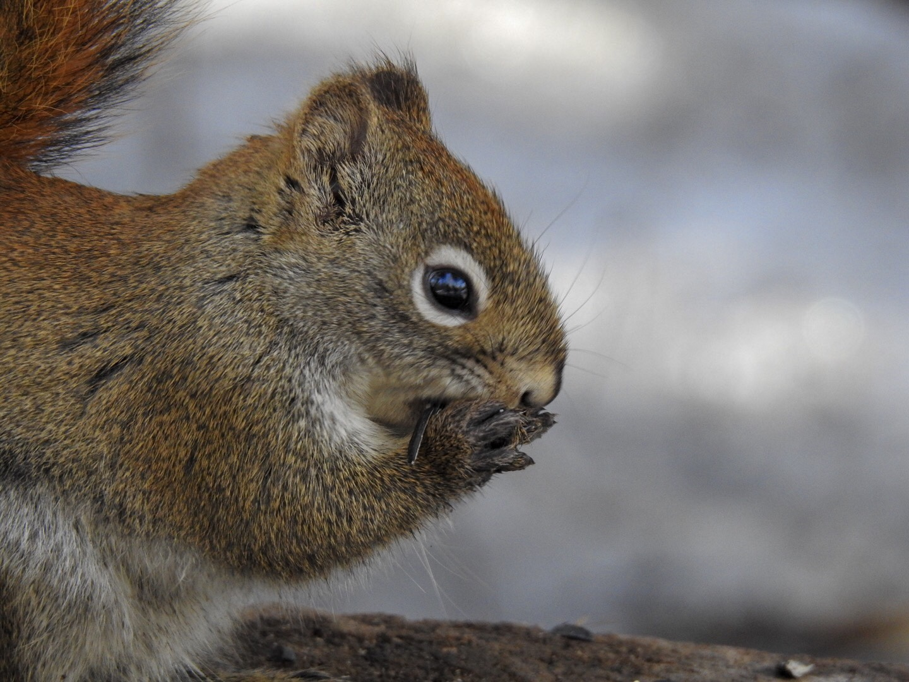

What is Project 366? Read more [here](https://thebirdsarecalling.com/2019/03/29/project-366/)!

As we are trying to figure how to use our new camera for wildlife photography one of the main challenges always seems to be to try to get close enough to your subject. Well, that is not a problem with the local American Red Squirrel population. This picture was taken with our Nikon P900 at a focal length of 116 mm (650 mm at 35 mm equivalent) from only a few meters away. The little guy (or gal) was preoccupied gobbling down as many sunflower seed as possible and could not care less about us inching our way closer and closer while our camera was shooting away. In the Edmonton area we are still fortunate to have a thriving population of Red Squirrels, they are just as easily spotted in the local park or forest as in our neighbourhood backyards. They can be bold and brazen and very opportunistic. I have lost count of the number of squirrels I have had to evict from our house over the years,... that’s evicting from inside the house. While they might be cute one day and a brazen pest the next we are fortunate in Edmonton that the Eastern Gray Squirrel has not been introduced here. It is an introduced species in various locations in eastern North America, including in Vancouver and Calgary. In these cities it has become the predominant squirrel, essentially essentially replacing the native squirrels.

_May the curiosity be with you. This is from “The Birds are Calling” blog ([www.thebirdsarecalling](http://www.thebirdsarecalling)). Copyright Mario Pineda._
