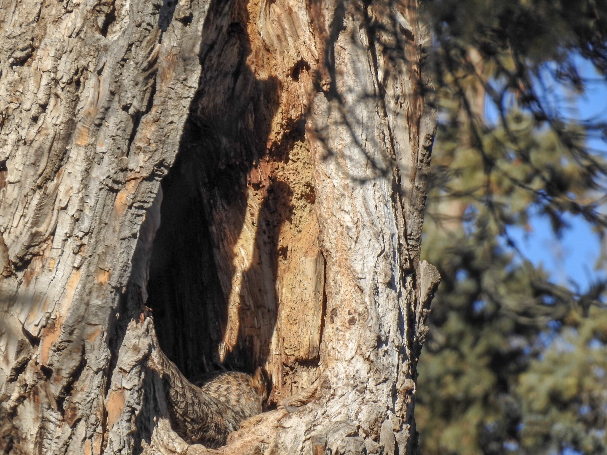

What is Project 366? Read more [here](https://thebirdsarecalling.com/2019/03/29/project-366/)!

The female Great Horned Owl in Whitemud Ravine is on her 29’th day sitting the eggs. We have been down checking in on her several times a week in the last little while and she is always in her nest. The male is always on guard in a nearby tree. In this picture you can see her feathery rear end and the back of her head with the two characteristic “horns”, which are actually tufts of feathers. The significance of the horns is not fully understood but it is believed they are used in social interactions. The owl couple is always very chilled when we are around (which is during the day) and one can always see Red Squirrels defiantly romping around in the understory right below the owls. I suspect the tables are turned once darkness falls. I have entertained the idea of heading down to the owls at night. The next full moon is on March 20. Let’s see if I can convince anyone else to joint me on a night time nature walk.

_May the curiosity be with you. This is from “The Birds are Calling” blog ([www.thebirdsarecalling](http://www.thebirdsarecalling)). Copyright Mario Pineda._
