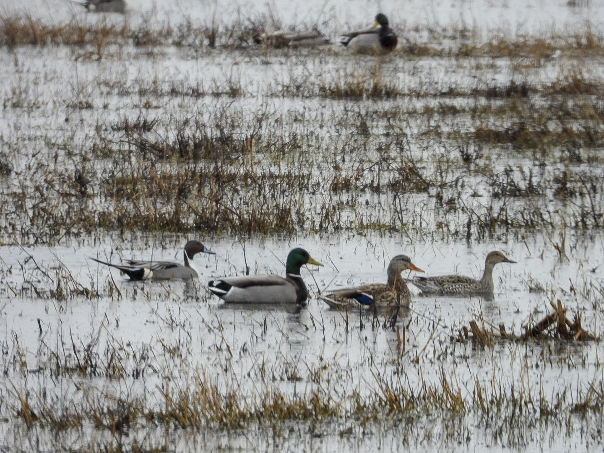

What is Project 366? Read more [here](https://thebirdsarecalling.com/2019/03/29/project-366/)!

It is difficult to have the Monday blues when you got to spend the gorgeous spring weekend in the great outdoors. I did an early morning foray to Elk Island National Park to catch the bison at sunrise (I did not manage to convince anyone else to join me) and we went on two trips out to the area east of Beaverhill Natural Area in search of the elusive Snow Goose. The Snow Goose chase is a story in itself but it suffice to say that we ended up crisscrossing the Range Roads and Township Roads in the area. Virtually all the snow is gone by now and the majority of ponds and lakes are ice free. Many of the fields are inundated with shallow ponds, something the water fowl are taking full advantage of. We did not focus our attention on these birds (the Snow Geese were calling) but during a brief pit stop on a dusty and desolated Range Road I took the following picture of some water fowl enjoying the gorgeous spring day. While the image quality and composition is nothing to write home about it serves as a good example of the genre of documentary wildlife photography I am aiming for. While beautiful composition and top notch image quality always is a bonus my aim is to document an interesting species, behaviour or natural history artefact. Image quality and composition comes secondary. This image was taken at 210 mm focal length with a Nikon P1000 (that is 1512 mm in terms of 35 mm) and with ISO 250. I took the picture to help me id the two Northern Pintails (male is far left and the female is far right) hanging out with the Mallard couple. While we have seen the Northern Pintail previously (in the Keephills Cooling ponds a few months ago) last time they were, well, pinpricks on the distant horizon and we just had to trust pro-birders with high-magnification scopes for the identification. To date this is the clearest and closest view I have ever had of Northern Pintails, which is oddly satisfying. This is precisely the reason why we recently got a super-zoom bridge camera. So far it is serving its intended purpose. In the one week that we have used it, pictures from this camera has helped us to identify three different species, Northern Pintail, Rough-Legged Hawk and American Tree Sparrow (the last two being lifers).

_May the curiosity be with you. This is from “The Birds are Calling” blog ([www.thebirdsarecalling.com](http://www.thebirdsarecalling.com)). Copyright Mario Pineda._
