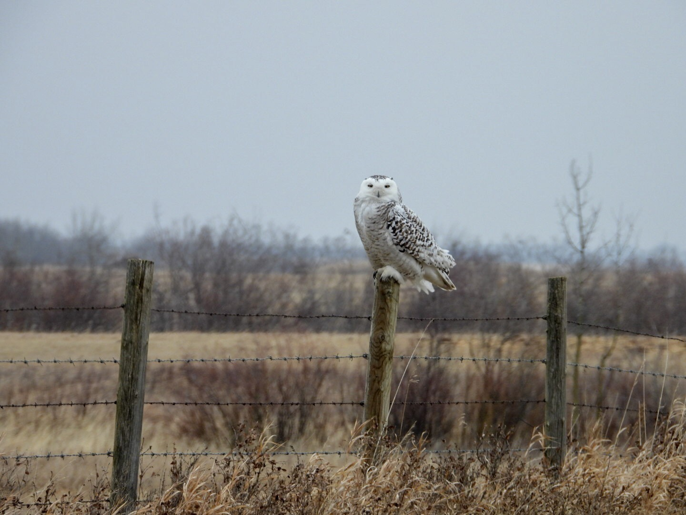

What is Project 366? Read more [here](https://thebirdsarecalling.com/2019/03/29/project-366/)!

Snowy Owls spend the winters in Alberta only to return to the arctic in March and April. Last weekend (April 6) we were out by Beaverhills Lake Natural Area, crisscrossing the country roads looking for returning migrants. We were hoping for a diverse assortment of water fowl and crossing our fingers for the ephemeral Snow Goose. We had just checked out a waterlogged field where a large group of Snow Geese had been seen the previous day. Alas, they had moved on by the time we made it there. A bit bummed we rumbled on along the dusty gravel roads when, all of a sudden, in the distance I noticed a large “poofy” mass on top of a fence post along the road. Although I am an owl noob, I have seen enough owls this winter that I know to scan for “large poofy masses”. I though to myself, “that looks like an owl”, never actually seriously thinking it would be an owl. As we approached, I could not help myself from slowing down, just in case. Well, would you believe it. It was a lonesome and gorgeous Snowy Owl. The car came to a screeching halt. I yelled to my companions in the back seat: “OWL UP AHEAD”. Everyone dropped what they were doing. I have never seen a pair of teens becoming unglued from their cell phones so fast. We had barely come to a stop, the windows were already down, binoculars up and I threw myself out of the car with the camera ready to shoot. The owl could not care less. It sat there looking at us indifferently and eerily cool. This was an unexpected treat. While we did see a Snowy Owl a few months ago I had simply assumed that they had all left for their arctic summer. Checking eBird later that day, revealed that, indeed the only Snowy Owl sightings for the month of April in Alberta were right in the area were we were. As a matter of fact, the same day another reporting of a Snowy Owl was recorded just a few km away along the same range road. Could it be the same owl? It’s possible, or maybe there are more holding on to our Alberta spring. I assume this will be the last Snowy Owl for this winter. So long Snowy Owls. Bon voyage and see you next winter.

_May the curiosity be with you. This is from “The Birds are Calling” blog ([www.thebirdsarecalling.com](http://www.thebirdsarecalling.com)). Copyright Mario Pineda._
