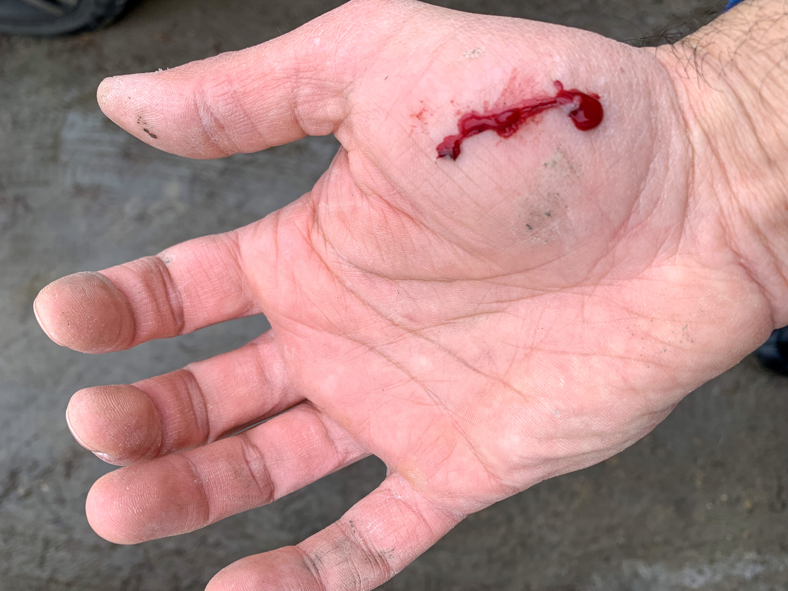
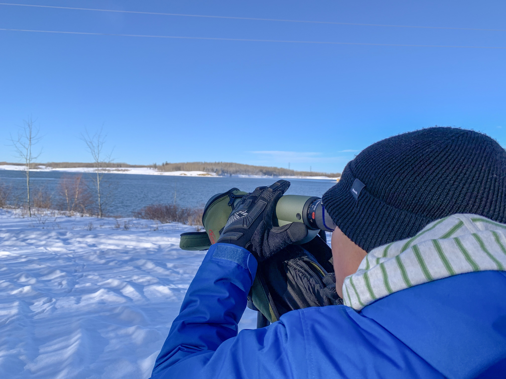

Not all nature walks go as planed. While part of the excitement of heading out into the wild is that you never knows what you will see, sometimes unexpected events arise due to human errors (or human stupidity). During three recent nature walks things did not unfold as planed due to human (= my) mistakes. Here are these recent fails and the lessons I learned from them. A word of warning; there is some graphical content below. If you are squeamish at the sight of blood you might want to stop here and avoid scrolling past this point.

## Fail #1

A few weeks ago I went birding in the Whitemud Ravine. It was a mild day and the trails were icy after several weeks of thaw-freeze cycles. Shortly after leaving the car I realized I had forgot my finger gloves in the car. As it was not cold I decided to forgo the gloves. I often veer of the beaten trail in favour of “off-roading” through the understory and along riparian vegetation. This time was no different. As I was descending a trail-less and particularly steep and icy section, I lost my footing, slammed into the ground and went sliding down the icy and muddy slope on my back. As my arms were flailing trying to grab hold of something to arrest my fall, I grabbed a thin tree trunk that ended up cut the palm of my hand. I always use gloves when I am out, both to keep fingers warm and for protection. As irony has it, the one time I did not bring gloves I ended up with a bad cut on my hand. I also did not bring a first aid kit so I had to seek medical attention from the ski patrol at a nearby ski hill. The least enjoyable part of the experience was when they had to dig out pieces of bark stuck in the gash. Take home message - always bring (wear) gloves and bring a small first aid kit! Oh, I and I should also get [traction devices](https://www.mec.ca/en/product/5051-633/City-Ice-Cleats).

## Fail #2

It was 6 am on a Sunday morning and I had decided to head out to Elk Island National Park to watch bison at the sunrise. It was a cold winter morning and, as expected, very quiet and tranquile at Elk Island. Once I arrived at the Bison Loop and started to assemble my gear I realized that I had forgotten my gloves (again) and my toque, and my sweater. While hiking around kept me somewhat warm, anytime I stopped and tried to use the camera or binoculars my fingers rapidly froze and became useless appendages. Take home message - always being warm clothes, gloves and a toque! It can be surprisingly chilly early in the morning (even in the summer) and when watching or photographing wildlife one often stands (or sits) still for long periods of time.

## Fail #3

The following weekend I tried the Elk Island National Park at sunrise field trip again. By now I had been labelled a complete loonie by the rest of the family..., but the birds are calling..., so I got to go. It was a beautiful morning. The sky was clear and the sun was rising. What could possibly go wrong? I triple checked that I had packed my gloves, warm clothes and a small first aid kit. Finding myself at the Bison Loop again, getting myself ready to head out..., to my horror I realize that I forgot to bring the binoculars. I can suck up physical injury, blood, pain and suffering but to go wildlife watching and birding without your binoculars..., that is unheard of. It’s unforgivable. Fortunately I had my Nikon P1000 with me so it had to serve as a binocular substitute, a job it does not do very well. Take home message - do not forget the binoculars!

Good luck trying to use a scope, binoculars or a camera without gloves when the mercury drops.

These are too many fails in too short of a time. Getting out into nature is supposed to reduce stress, not increase or cause stress. Time to reboot my brain, pull up my socks and get seriously organized. It is not like I am trying to land one the moon. It’s just a nature walk for Pete’s sake.

_May the curiosity be with you. This is from “The Birds are Calling” blog ([www.thebirdsarecalling.com](http://www.thebirdsarecalling.com)). Copyright Mario Pineda._
