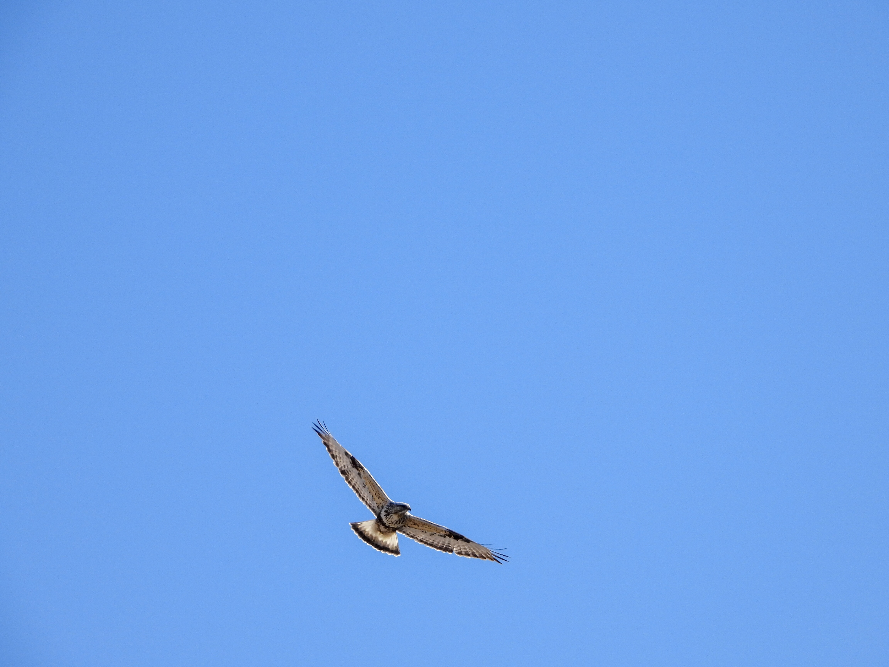

What is Project 366? Read more [here](https://thebirdsarecalling.com/2019/03/29/project-366/)!

This time of year the area East of Beaverhill Natural Area is buzzing with returning migrants and where there is food, there are predators. I imagine the birds of prey must be busy hunting to recover from (or prepare for) their migration and get ready for breading season. This area has a rich diversity of birds, probably because of its vicinity to the Beaverhill Natural Area and the Beaverhill Lake, which is an important habitat for migrants and shorebirds in particular. We spend most of the last weekend in this area and were treated to an abundance of species, including a Snowy Owl and more Rough-legged Hawks that I can count. It was as if every tree along the road had a hawk in it. Many of them were soaring or hovering in the strong breeze over the vast open stubble fields. Occasionally one would focus in on a specific spot far out in a field, hover above it and then do a kamikaze-like dive towards the ground. Clearly they were in a hunting mode. We never saw one actually catch anything, so I am not sure what success rate is. I imagine, however, that with the snow gone and nothing growing on the fields yet, it must be a good set up for spotting any little rodent scurrying around on the ground. This was also an opportunity to test our new camera set up for some BIF (Birds In Flight) shooting. With a beautiful blue sky, no clouds in sight and the sun beaming down the conditions were perfect for some awesome photography. We did manage to get a few keepers, including the photo below of an adult light morph Rough-legged Hawk looking for his or her next meal. Apparently the “hockey pucks” on the wrists are typical identifies. During the summer Rough-legged Hawks breed in the arctic and during the winters they migrate to southern Canada and the USA.

_May the curiosity be with you. This is from “The Birds are Calling” blog ([www.thebirdsarecalling.com](http://www.thebirdsarecalling.com)). Copyright Mario Pineda._
