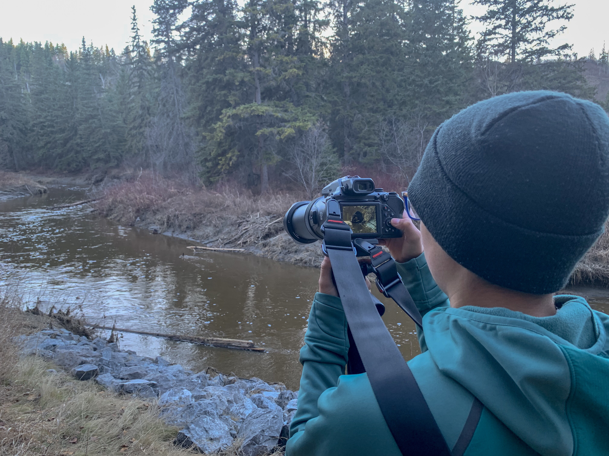

What is Project 366? Read more [here](https://thebirdsarecalling.com/2019/03/29/project-366/)!

Monday after school we grabbed a quick snack, out gear and headed right down to the Whitemud Ravine. After a weekend of birding out of town we were antsy to check in on our Great-horned Owl couple. The female is in a large tree cavity sitting on eggs while the male is always on guard in a nearby tree. The eggs are predicted to hatch any day now. Well, they were still there. Nothing new and no indications that the eggs have hatched. Other than mom and pops owl, there was not much bird action along the creek. The lack of birds was, however, more than made up by beaver action. There were beavers everywhere. Swimming in the creek, sitting on the banks and waddling along the shore. We stopped counting at ten beavers and instead focused on trying to shoot pictures instead. Unfortunately it was an overcast day and the sun was getting low so our bridge camera had trouble with the low light. The photos turned out blurry no matter how we sliced it. Either the shutter speed was to slow or the ISO was to high. Even without the pictures though it was quite a show. Some of the beavers were “muzzle wrestling”, they swam up towards each other, their muzzles side by side and then they pushed each other around in the water. The interaction was not overly aggressive so I am not sure if these were hostile or friendly encounters. On our way back to the car we managed to track down a rumoured porcupine sitting high in a pine tree. We have heard stories of this fella from other birders but we have never managed to track him/her down..., until today. Clearly the porcupine did not want to be disturbed so we took a few grainy pictures of his spiky derrière and called it a day.

_May the curiosity be with you. This is from “The Birds are Calling” blog ([www.thebirdsarecalling.com](http://www.thebirdsarecalling.com)). Copyright Mario Pineda._
