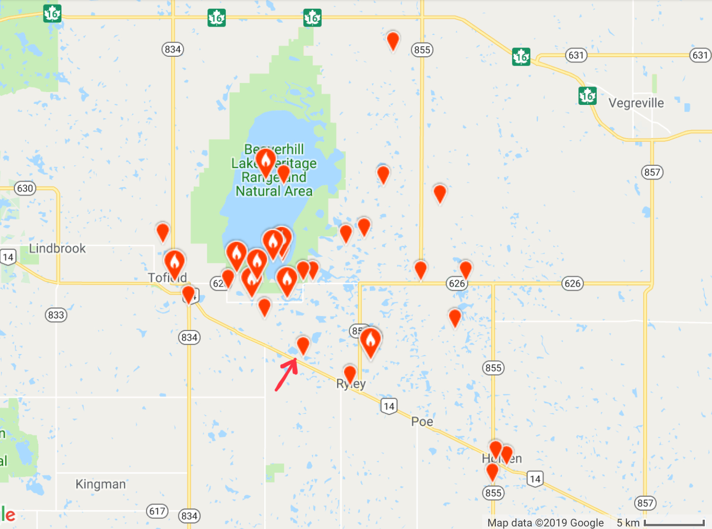
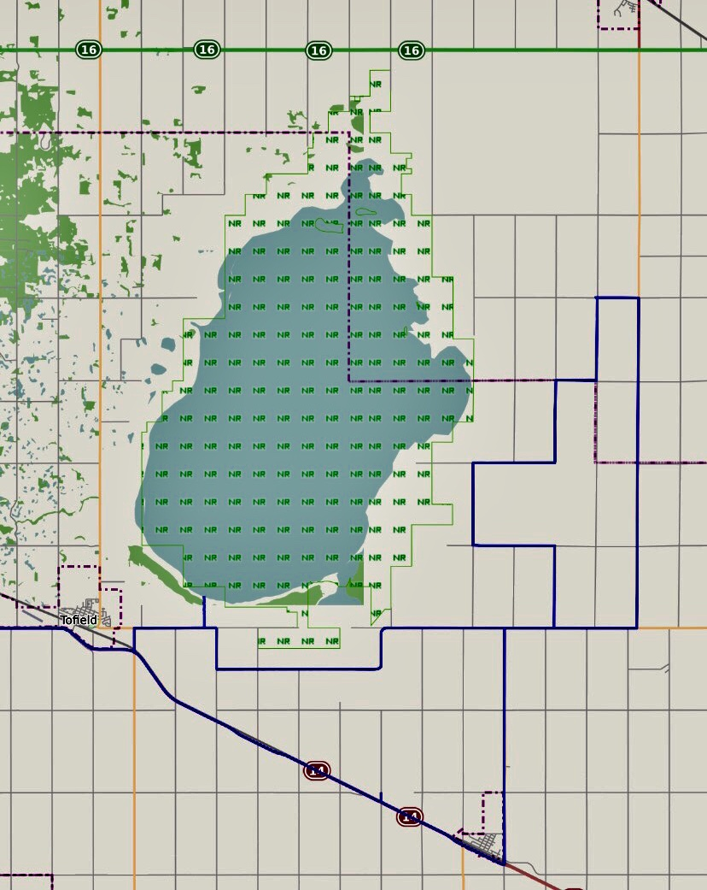

Over the last few weeks we have been searching high and low for the elusive Snow Goose. These geese breed and raise their chicks in the high arctic tundra during the summer and spend the winters in continental U.S.A. and Mexico, a migration of up to 5000 km. During their migration they fly at high altitudes in very large flocks (in the tens of thousands). Between the spring and fall migration they spend about 6 months a year on the “road”, travelling between their winter and summer habitats. During their migration they have several layovers to rest and refuel. One of these pit stops takes place East of Edmonton around the Beaverhill Natural Area. When the reports a few weeks back started rolling in of flocks with large numbers of Snow Geese being spotted, the chase was on.

The graphics below shows eBird reported sightings of Snow Geese in the Edmonton area over the last year. This screenshot was made mid-April (black vertical line indicates the date) and evidently the geese hang out in our area all throughout May before continuing on their north-bound migration at the end of May and beginning of June. The good news here is that we still have opportunities to see them during this migration before they leave. The next time they will be in our vicinity is between September to November when they are heading south to their overwintering grounds.

The map below shows the reported Snow Geese sightings around Beaverhill Lake in April this year, so basically roughly over the last three weeks. The location indicated by the arrow is where we found them. In our quest to find the Snow Geese we covered several hundred kilometres of dusty back roads in this area during three separate field trips. We visited most of the location where they have been reported this month. It appears, however, that the geese are quite mobile. While we saw lots of other birds (e.g. Canada Goose, Cackling Goose, Mallard, Northern Pintail, Northern Harrier, Rough-legged Hawk, Black-billed Magpie, European Starling, Ring-billed Gull, American Crow, Black-capped Chickadee), we never managed to catch the Snow Geese in any of the previously reported locations. In the end, once we had basically given up and started to head home, we stumbled across them at a location where they had not previously been reported at perhaps the most unlikely of places, a small lake at this side of a busy highway.

The map below is the GPS track of our last field trip looking for the geese. The “blip” on the track between the two highway markers on the south side of the map is where we found the geese in the end.

A short video clip of the Snow Geese taking off from the lake. I am, not sure what made them decide to leave. It could have been our presence, but I doubt it as we were quite some distance away hiding behind the reeds. The video was shoot From a large distance at a high-zoom magnification with our Nikon P1000. It is more likely that the large flock of geese flying overhead might have enticed the geese on the lake to take off and join them in their search of another lake in the area.

https://youtu.be/RZlWLtsQQS0

Picture below shows a “cloud” of Snow Geese in the background. The birds taking off in the foreground are Canada Geese. The Snow Geese cloud extended across much of the horizon as it was rapidly moving away from us. I am still struggling with wrapping my head around how to best estimate the number of individuals in massive flocks like this. There are techniques described online for estimating population numbers in airborne flocks by visually breaking the flock into units of 10, or 100, or 1000, and then estimate the number of "units" within the flock (see for example the [following link](https://www.fws.gov/waterfowlsurveys/forms/counting.jsp?menu=counting)). I cannot see how one can do this successfully (= accurately) “on the fly” in the spur of the moment. If one can take a good quality photograph or video of the entire flock then one can analyze the images or video back at home and perhaps get a more accurate estimate. It would be interesting to try this out next time we see them (or any other large flock of birds).

I tried to find out if the lake has a name, but it appears it does not. There are thousands of small pothole lakes in their area so I assume most of them remain un-named.

The Snow Goose is species 49 on our Alberta Big Year List and species 101 on my Life List. Unbeknown to us at the time, our 100th species was a Northern Harrier which was a “collateral” find during our quest for the Snow Goose. It was not until we came home and recorded our sightings that we realized the significance of the Northern Harrier sighting. And we did not even get a picture of it. I guess we will just have to keep better track of our tally to make sure we get a picture of the next milestone - The Big 200. That’s quite some ways down the road though.

_May the curiosity be with you. This is from “The Birds are Calling” blog ([www.thebirdsarecalling.com](http://www.thebirdsarecalling.com)). Copyright Mario Pineda._
