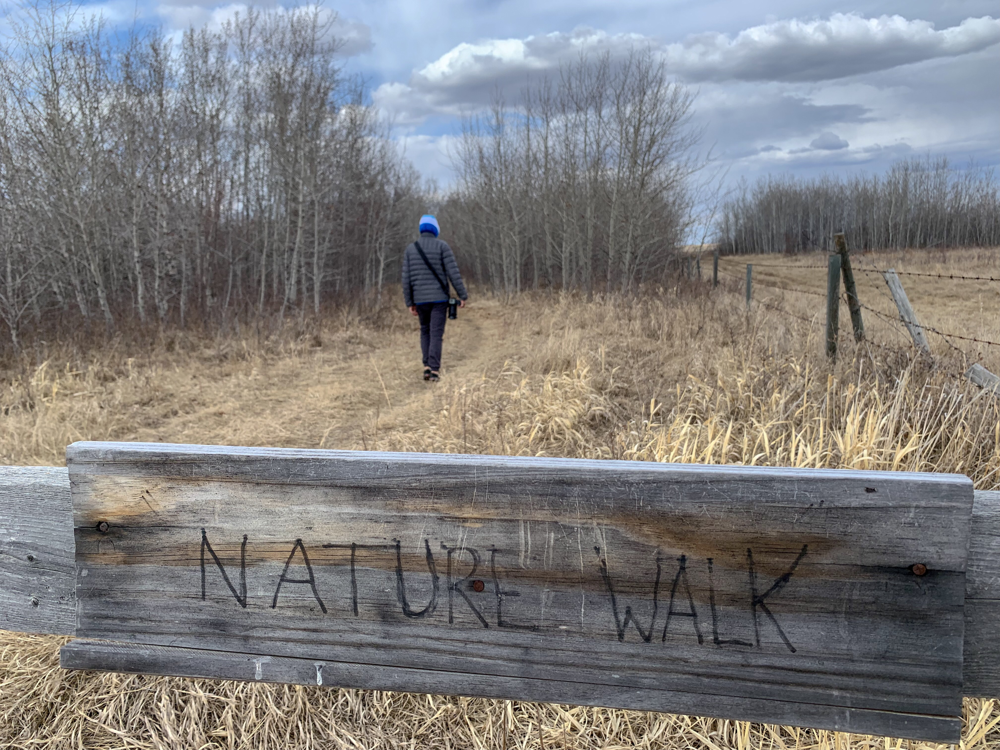

What is Project 366? Read more [here](https://thebirdsarecalling.com/2019/03/29/project-366/)!

We visited Francis Point last weekend as part of out Snow Geese chase. It was a windy day and the birds were notably absent. What the nature walk lacked in birds, however, the frogs made up for with a chorus of song. Even in the tiniest and most ephemeral of ponds the frogs were croaking loudly in unison as they were getting into an amorous mood. The frogs made a duck-like quacking sound that initially confused us. A [recent survey](http://www.beaverhillbirds.com/media/1602/amphibian-report-jordan-lange.pdf) of amphibians at the nearby Beaverhill Bird Observatory only found Wood Frogs (_Rana sylvatica_ or _Lithobates sylvaticus_) and o with only anecdotal evidence of Boreal Chorus Frogs (_Pseudacris maculate_) in the area. The Wood Frog is the most widely distributed amphibian in Canada and is associated with moist woodlands and vernal woodland pools. Wood Frogs are the earliest breeders in most of their range. Wood Frogs are known to be exceptionally freeze tolerant with their blood and tissue often freezing during the winter. We made a feeble attempt to visually spot the frogs, but anytime we approached a pond the chorus immediately fell silent. We figured that was their way of saying: “Leave us alone - we are busy”.

_May the curiosity be with you. This is from “The Birds are Calling” blog ([www.thebirdsarecalling.com](http://www.thebirdsarecalling.com)). Copyright Mario Pineda._
