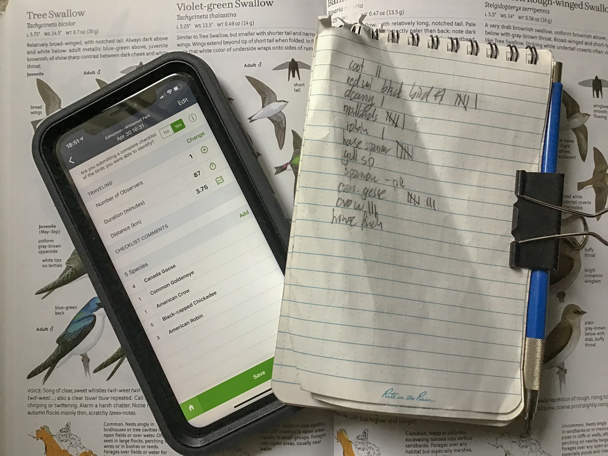
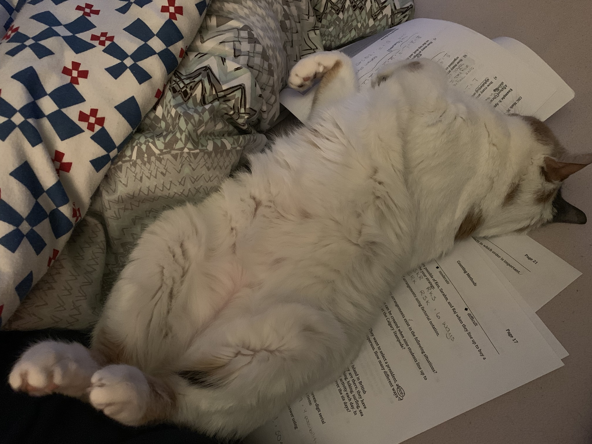
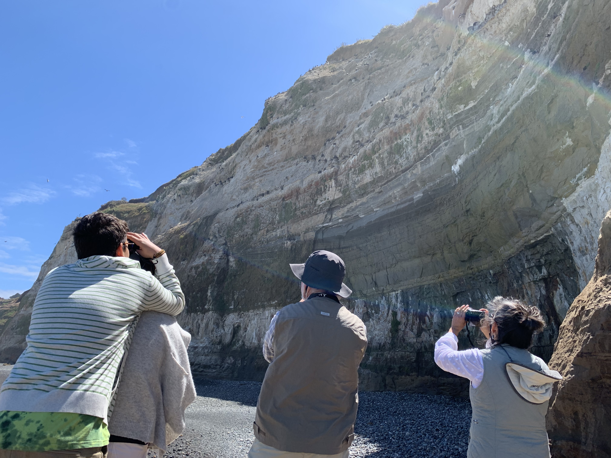

I have been doing regular nature walks for a tad over four months now. While the focus of my outings typically is on birding, I go with an open mind and are game for any nature observations that I come across. Now, four months of going for walks in the forest does not make me an expert nor have I had any profound insights, but there are a few things that I have come to realize make at least my nature walks more enjoyable. So here it is, in true David Letterman style, the Top Ten Things Not to do When Going on a Nature Walk...

My first official nature walk, ever. December 16, 2018 at Beaverhill Bird Observatory in -25C (Alberta, Canada).

### 1\. Don’t bring your phone

Turn it off, or even better, leave it behind (gasp!). And for Pete’s sake, whatever you do, don’t under any circumstance use your headphones. Nature walks are all about being present in the moment and cell phones...well, they have the exact opposite effect on your brain. Nuff said. Damn your eBird and Merlin for making such awesome apps. Yes it is convenient, but the last thing I want to do when watching birds is to be on my phone. The solution is of course simple, take notes in a notebook with a pencil and take pictures (not with your cellphone),... or even better, draw the bird (still mustering up courage for that one).

I get it, the eBird app is super convenient, but the last thing I want is to be staring on a device while out in nature. To the rescue, the good old fashioned paper notebook. If you want to go high-end you get a Rite in the Rain All-Weather notebook so you can continue jotting down observations during a down pour. It also does not use up your data plan or run out of batteries.

### 2\. Don’t finish **your** chores

If you are anything like me, the chores at home will never end. If you are aiming to finish your chores and then reward yourself with, say, a nature walk, you will likely never go. With kids and pets in the house and working adults, getting your castle into tip top show home cleanliness and organization is a Sisyphean task with rapidly diminishing returns. My grandmother always said, “You do not live in a museum, get out and live”. The dishes can wait, the birds are calling and I must go!

Cats would never finish their chores, if they had any. Teens have chores, but just like cats, do not finish them either. So why should responsible hardworking parents have to finish their chores when they can go for a walk in the forest instead?

### 3\. Don’t be unprepared

...but don’t over do it. What “being prepared means” obviously depends on where you are going and for how long. But even for the shortest of nature walks in my local forest patch I always bring the following items,

- binoculars
- camera with spare battery
- small lens cleaning kit
- my home made trail mix that is equally suitable for humans, squirrels and birds
- notepad and pencil
- a pocket knife
- toque (that’s Canadian lingo for a close-knitted woollen hat) or a cap, depending on the season
- finger gloves with cutoff fingers, or beefier gloves in the winter
- cell phone..., well, this is awkward,... clearly I am not practicing what I am preaching (see #1 above). In my defence, I never actually take the phone out and its on silent. I carry it so it can track my location and the number of steps (this might sound like a lame execute, but as a high school teacher I have unparalleled expertise in hearing lame cell phone excuses).
- field guide(s). Yes, I actually bring the brick-sized field guides, but I leave them in the car. Once I am back in the car after the walk I enter my eBird observations and check the field guide for anything that was tricky to id.

Be prepared, bring your bins and your Sibley.

### 4\. Don’t be “somewhere else”

Another word for not being “somewhere else” is mindfulness. Be aware of your surrounding. Listen to to the forest, smell the environment, feel the air on your skin and feel your fingers go numb as you try coax your binoculars into focus on a cold winter morning. The birds can help you with this one. If you just look for the birds you notice other things, things you were not looking for in the first place.

Valley of the Five Trails in Jasper National Park. It is not hard to be awestruck and fully in the moment with this view (Alberta, Canada).

### 5\. Don’t go alone,... don’t go with others,...

...do both. Go alone. Go with a friend. Go with your family. Go with strangers. While many of my outings have been with my modestly sized family, other field trips are with (non-birding) friends, or with a black belt birders from Edmonton Nature Club, yet other are solo excursions. Perhaps not surprisingly, I have found that it is difficult to convince anyone to join you for a pre-dawn field trip on, say, a Saturday or Sunday morning. As a result, I have done several early morning field trips to Elk Island National Park to hang out with the bison at sunrise while the rest of the gang get to sleep in.

It’s difficult not to get bitten by the birding bug when finding a colony of thousands of Red-legged Cormorants at the edge of the Pacific Ocean. Boca Budi (Araucanía, Chile).

### 6\. Don’t let the weather be your foe

Let the weather be your ally. Embrace the sun, rain, wind or freezing temperatures. There is no bad weather, just bad attitude towards the weather. The same forest in different weather will be a completely different experience. Either way, the animals in the forest never complain about the weather, they just deal with it. Why should we be any different?

Canadian-style sisu. A bit of ice slurry never stopped a beaver from going for a swim. (Whitemud Creek, Edmonton, Alberta, Canada).

### 7\. Don’t go at the same time every time

Mix up the times. Go after work. Go first thing in the morning on a day off. Go at night. Go midday. Depending on the time, different critters will be out and about.

Animals tend to be most active at dawn. If the animals in the forest don’t get to sleep in, why should you? Fifth Lake at Valley of the Five Lakes, Jasper National Park (Alberta, Canada).

### 8\. Don’t walk

I know. It’s called a “nature walk”, but surprising things might happen if you stop and listen and just be one with the environment. I tend to mostly be on the move when I go for a nature walk, but if you stop and stay put for a while you slowly become one with the surrounding forest and you might start noticing some of the more subtle things that are easy to miss, or as scallywag Master Gibbs puts it in The Curse of the Black Pearl:

> He waded out into the shallows and there he waited three days and three nights till all manner of sea creature came and acclimated to his presence.
> 
>   

https://flic.kr/p/2fs3GTt

Spending time at a bird blind can be an exercise in patience. (Francis Point, Beaverhill Nature Area, Alberta, Canada).

###   

### 10\. Don’t rush!

Last but not least, if you rush it you are better off not going. There are two possible strategies here, either take your time and finish when you are finished, which assumes that you have time on your side. Alternatively, if you have limited time, adjust your outing to fit your schedule. Don’t try to rush through a nature walk just to get it done so you can move on to the next item on your to do list. Nature walks cannot be rushed, it’s not in their nature.

Taking time for a [fika](https://en.m.wikipedia.org/wiki/Coffee_culture#Sweden) during a nature walk is the antidote to rushing. Notice the bird-like drinking behaviour of the hot coco. Drinking your hot beverage like a bird is not a required part of the fika culture (Beaverhill Bird Observatory, Alberta, Canada).

_May the curiosity be with you. This is from “The Birds are Calling” blog ([www.thebirdsarecalling.com](http://www.thebirdsarecalling.com)). Copyright Mario Pineda._
