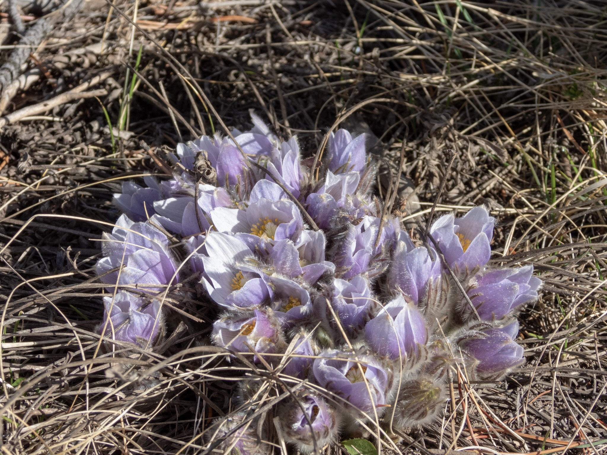

What is Project 366? Read more [here](https://thebirdsarecalling.com/2019/03/29/project-366/)!

Last weekend we came across our first plant in bloom of the year. Perhaps not surprisingly, it was a Prairie crocus (_Anemone patens_). Surprisingly (perhaps) we found it in Jasper National Park at a location that is at about 400m higher (1362ft) in elevation than Edmonton (1060m vs. 645m, 3478ft vs. 2116ft). I had assumed that spring would be running later in the valley bottoms of Jasper National Park than in Edmonton, but I was proven wrong. This fury little harbinger of spring is actually not a crocus at all, but rather an anemone in the Buttercup family. The prairie crocus only blooms during roughly a two week period, starting in mid-April. The phenology (the study of seasonal timing of life-cycle events) of the prairie crocus is, however, in a state of flux due to anthropogenic climate change. In [a 2011 study](https://academic.oup.com/bioscience/article/61/7/514/265999) researchers found that between 1936-2006 the mean monthly spring temperature increased between 1.5 °C-5.6 °C (depending on the month) in the central parklands of Alberta. As a result, the timing of the Prairie crocus blooming has shifted and is now (or at least in 2006) up to two weeks earlier than in 1936. This was in 2006, 13 years ago. The warming trend has of course continued since then and it would be interesting to know what effects it has had on the phenology of the Prairie crocus (and other plans and animals) since. One more good reason to hit the low elevation trails sooner rather than later. The crocuses are calling!

Nikon P1000, 116mm equivalent, 1/640s, f/4, ISO 100

_May the curiosity be with you. This is from “The Birds are Calling” blog ([www.thebirdsarecalling.com](http://www.thebirdsarecalling.com)). Copyright Mario Pineda._
