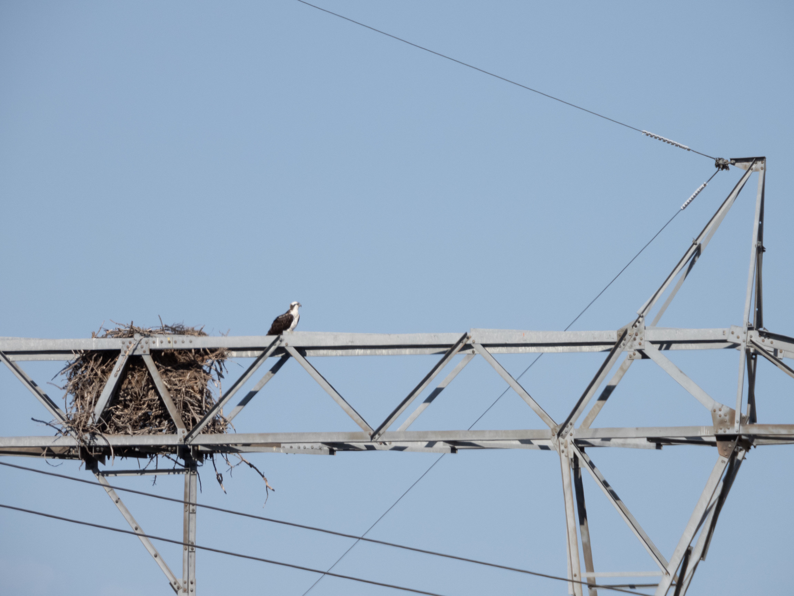

What is Project 366? Read more [here](https://thebirdsarecalling.com/2019/03/29/project-366/)!

As you head out of Edmonton on the Yellowhead Highway eastbound towards the mountain parks you pass by the sleepy village of Wabamun, primarily know for being one of the gateways to fishing in Wabamun Lake. On the left hand side of the highway, right by the ramp for Wabamun there are power transmission towers rising high above the surrounding forests. Right on top of one of the towers embedded into the steel lattice there is a large messy-looking stick nest. I noticed the nest several month ago in the middle of the winter as we were heading out on one of our field trips to Jasper. The minute I saw it, it intrigued me. Who build the nest? Does it get occupied during the breeding season? By whom? How large is it? How long has it been there? It clearly is a large nest, but without a known point of reference it is quite difficult to estimate its size. I suspected that it was most likely a raptor nest. Digging around on eBird did not reveal anything as I was unable to find any reported observations at this location. The winter came and went, spring arrived and we went back and forth to Jasper several times. The nest remained perched on the transmission tower and my curiosity just grew but did not get satisfied..., until last weekend. As we were on our way back from Jasper and were approaching the tower I had a feeling, a hunch if you will, that something was about to happen. As I was the driver I decided to forgo the temptation to reach for the binoculars. Instead I asked the rest of the gang in the car to get the binoculars and get into standby mode. Of course they had no idea what I was talking about so they were a bit slow,... too slow. As we emerged from under an overpass, there it was, the transmission tower and on top of it, right by the nest, two large white and dark brown raptors with fuzzy unkept “hairdos”. Id’ing was a breeze - they were a pair of Ospreys (_Pandion haliaetus_), the iconic fish raptors. These magnificent birds of prey became number 104 of our World Life List and 53 on our AB Big Year list. As we were cruising along at highway speeds we had passed them in a blink of an eye. At the next exit we turned around and went back to get a closer look. As we were admiring Mr. and Ms. Osprey some of my questions got their answer but new questions arose as well. Apparently an adult Osprey [is around to 60 cm (~24in) long](http://www.hww.ca/en/wildlife/birds/osprey.html). Using the individual in the picture as a referent suggests that the nest is between 3-4 Osprey units in diameter (i.e. 180cm-240cm, 72in-96in), a truly impressive size. Does this pair inhabit the same nest every year? Did they build it, or did they inherit it? Either way, as we parted ways (for this time) I wished the force to be with them in their truly electrifying abode.

Nikon P1000, 806mm equivalent, 1/800s, f/5.6, ISO 100

_May the curiosity be with you. This is from “The Birds are Calling” blog ([www.thebirdsarecalling.com](http://www.thebirdsarecalling.com)). Copyright Mario Pineda._
