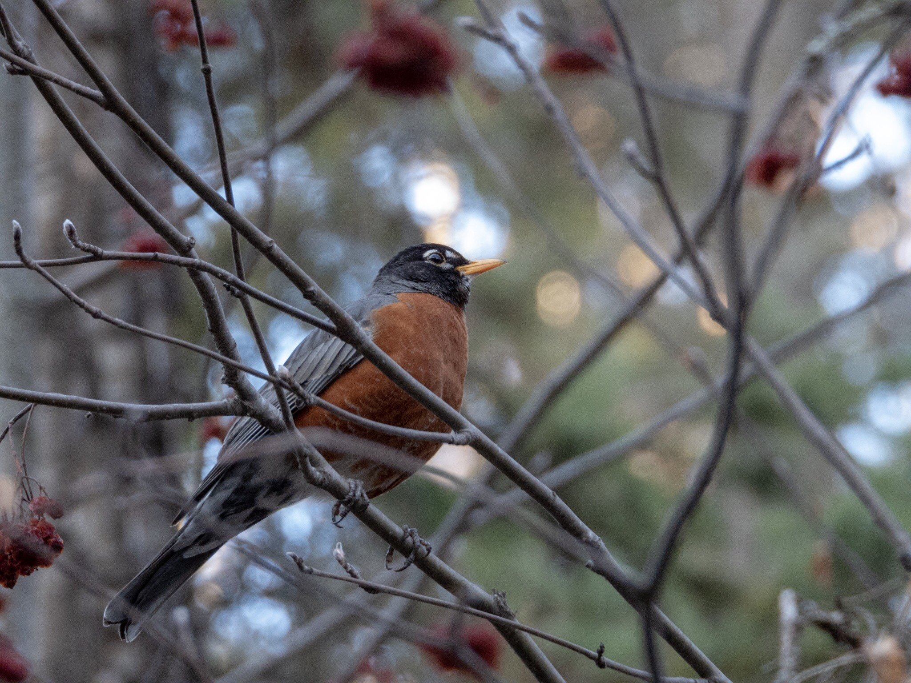

What is Project 366? Read more [here](https://thebirdsarecalling.com/2019/03/29/project-366/)!

I had been bushwhacking along the trails and through the brush at the Whitemud Creek for a few hours and the sun was getting low in the sky. I had just finished checking part of the trail where Pileated Woodpeckers often hang out (with no luck). As I started heading back a quick bout of chirping in the shrubbery along the trail caught my attention. The twilight made it tricky to find the culprit, but there it was - an American Robin sitting in a Mountain Ash just minding its own business. Initially I did not reach for my camera as I already have plenty of pictures of robins and it was getting too dark to take pictures anyway. The robin was, however, sitting completely still, almost like it was posing for me so I figured that I could at least try to get a picture of it. While I did have the camera on a monopod I figured that the chances of the pictures turning our would be quite slim. It was getting dark and there was jumble of twigs and branches between me and the robin. I doubted the camera would be able to focus properly through the shrubbery in the low light. To my surprise the camera nailed the focus immediately. At 1/60s (which is a really long exposure at 705mm zoom) and ISO 500 (which is a sure recipe for grainy images lacking detail) the exposure settings were a bit challenging to say the least. I ended up only taking a few pictures. When I inspected the images back at the car I was astonished. Every single image was razor sharp (by P1000 standards), the exposure was spot on and the the bokeh was awesome. The P1000 really throws me for loops at times. Only a few days earlier I had been [shooting Ospreys in transmission towers](http://thebirdsarecalling.com/2019/04/26/project-366-post-no-029-template/) under, what would be considered, ideal conditions (a backdrop of a bright blue sky, no interfering shrubbery, etc.). Despite this, I had great difficulty coaxing the camera into focusing properly (both with auto focus and manual focus) and the pictures came out unacceptably soft. For a brief moment the robin made me feel like a deadeye, but the truth is that I am still not able to wrap my head around why the camera struggled with the osprey in what should have been ideal conditions but nailed the robin in the twilight.

On a side note. This post is #30 of my Project 366. One month down, eleven to go. Congratulations to..., me! Keep up the great work. 😁

Nikon P1000, 705mm equivalent, 1/60s, f/5, ISO 500

_May the curiosity be with you. This is from “The Birds are Calling” blog ([www.thebirdsarecalling.com](http://www.thebirdsarecalling.com)). Copyright Mario Pineda._
