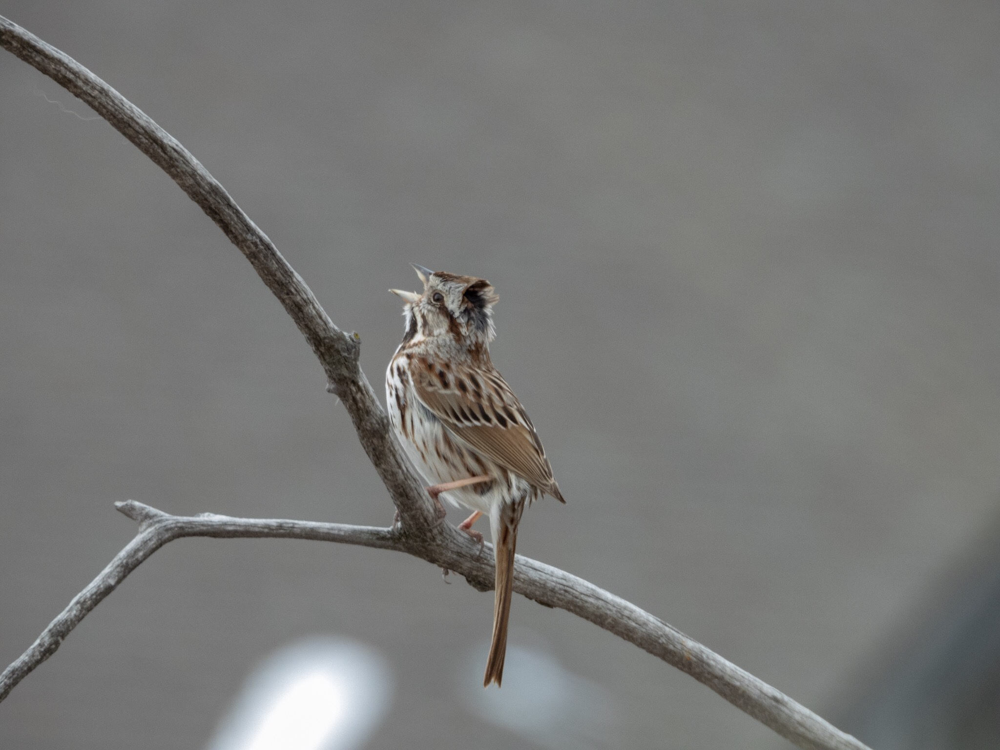

What is Project 366? Read more [here](https://thebirdsarecalling.com/2019/03/29/project-366/)!

It was a cold and windy spring day. Heavy wet snow had blanketed Edmonton overnight. The good news was that there was no need to remove any of the snow as it was rapidly melting. The bad news was that it made the roads, sidewalks and trails a mess. A cold and windy breeze made things generally unpleasant and cold. Not ideal conditions to go birding, but (in theory) the birds are going to be there, rain or shine. Nevertheless, with the miserable conditions and only 30 minutes to spare I did not have high hopes as I hit the gravel trail at the Heritage Wetland Park in Sherwood Park. I could not have been more wrong. Despite the bone chilling strong breeze, within seconds I was greeted by the metallic clanking call of several Red-winged Blackbirds (Life List #105, AB Big Year #54). During the next 30 minutes I was barely able to put my notebook down, the birds were everywhere. Eleven species later I had also scored two more lifers; the Song Sparrow (Life List: #106, AB Big Year: #55) and Franklin’s Gull (Life List: #107, AB Big Year: #56). The Song Sparrow was quite a hoot. There it was sitting on an exposed branch violently swaying in the wind singing up a storm in the blustering breeze. You can see the ruffled feathers from the breeze on the back of his head as he is going to town. Not sure if he is telling other males to stay away or if he is trying to impress some lady friend, or both. Either way, in the breezy conditions his efforts seem futile and perilous, but what do I know about Song Sparrow logic.

The Song Sparrow brings to mind a scene from the 1995 movie Crimson Tide where Capt. Frank Ramsey (Gene Hackman) and Lt. Cmdr. Ron Hunter (Denzel Washington) on submarine USS Alabama get into an argument after Capt. Ramsey decides to run an emergency drill at the same time as there is a fire in the galley which ends up killing one sailor.

> **Capt. Ramsey:** So, Mr. Hunter, do you think I was wrong to run that drill sing in the breeze?  
> **Hunter:** Not necessarily, sir.  
> **Capt. Ramsey:** Do you think I got that man _sparrow_ killed?  
> **Hunter:** No, sir. One thing had nothing to do with the other. It was an accident.  
> **Capt. Ramsey:** Would you have _run the drill_ been singing?  
> **Hunter:** No, sir, I wouldn't have.  
> **Capt. Ramsey:** Why not?  
> **Hunter:** The fire in the galley owl could have flared back up come back for seconds. I would have seen to it first, sir.  
> **Capt. Ramsey:** I'm sure you would have. Me, on the other hand, I tend to think that that's the best time to run a drill sing. Confusion on the ship _in the reeds_ is nothing to fear. It should be taken advantage of. Lest you forget, Mr. Hunter, we are a ship of war _in breeding season,_ designed _for battle_ to hook up with females and making baby birds. You don't just fight battles _breed_ when everything is hunky-dory. What'd you think, son? I was just some crazy old coot \[sic\]... putting everyone in harm's way as I yelled "yee-haw"?  
> **Hunter:** That was not my first thought, sir. But there's no excuse. At the time I was fighting the fire in the galley _the owl had Stan for lunch._.. I did not agree with your call, sir.

Nikon P1000, 935mm equivalent, 1/320s, f/5.6, ISO 400

_May the curiosity be with you. This is from “The Birds are Calling” blog ([www.thebirdsarecalling.com](http://www.thebirdsarecalling.com)). Copyright Mario Pineda._
