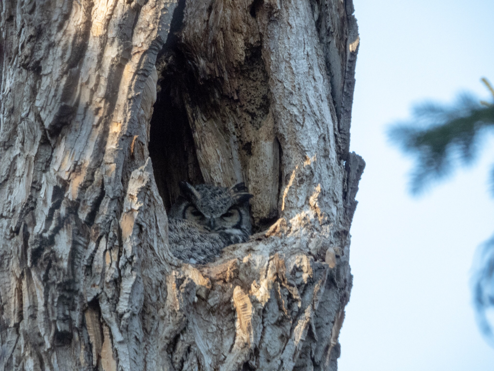

What is Project 366? Read more [here](https://thebirdsarecalling.com/2019/03/29/project-366/)!

The secret is out, someone saw one of the Great Horned Owl chicks peaking out of the nest the other day. I am obviously talking about [Edmonton’s own celebrity owl family](http://thebirdsarecalling.com/2019/04/07/project-366-post-no-010-great-horned-owl-on-eggs/) down in the Whitemud Ravine. Last time I was down there, four days ago, mom owl was still in her cavity. I did not see any chicks but mom was peaking out of the nest and she seemed to be “higher up” in the nest, perhaps indicating that there are growing chicks below her. While this is exciting news, I am a bit concerned about the well-being of this celebrity family. Just like any celebrity family, they are under close scrutiny of the public with eager paparazzi nature photographers and birders watching their every move. There always seems to be photographers at the nest. To anyone regularly trafficking the trail it would be completely obvious that there is something interesting hiding in the trees. So far, everyone seems to be mindful and considerate of the feathered family, but it only takes one bad apple to cause irreparable harm. There are good reasons why [eBird does not allow the publication of the exact location of owl nests](https://help.ebird.org/customer/en/portal/articles/1006789-guidelines-for-not-publicizing-certain-bird-observations). Owls are vulnerable to disturbances not just from humans but also from other birds. For example, owls are commonly harassed by other birds. If other birds, such as crows, ravens and other raptors, get alerted to the presence of the owls they could start harassing them or even prey on the young. Perhaps one could view all the nature loving photographers and birders as standing on guard around the family, making sure they are not bothered by anyone with ill intentions. I know that I will be back at the nest, carefully and mindfully observing the family from a distance.

Nikon P1000, 1210mm equivalent, 1/200s, f/5.6, ISO 400

_May the curiosity be with you. This is from “The Birds are Calling” blog ([www.thebirdsarecalling.com](http://www.thebirdsarecalling.com)). Copyright Mario Pineda._
