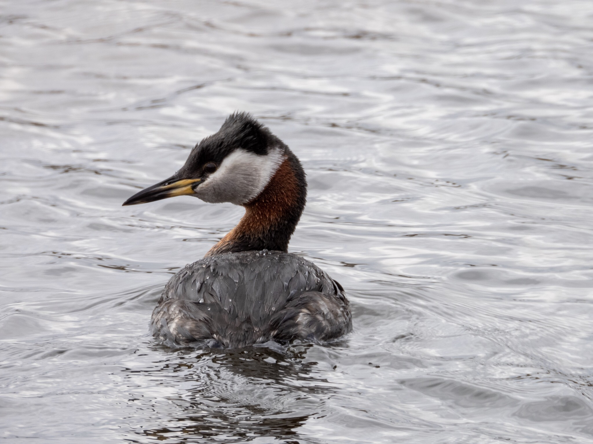

What is Project 366? Read more [here](https://thebirdsarecalling.com/2019/03/29/project-366/)!

I recently ventured to Heritage Wetlands Park in Sherwood Park. This wetland is in a curious place, located smack dab in the middle of a sub-divisions in Sherwood Park where it is surrounded by residential properties to the North and South and bounded by Clover Bar Road to the East and Highway 21 to the West. The park consists of four small ponds with plenty of reeds along the shores. No matter where you go you are looking into someone living room and there is no escape from the noise of the busy roadways nearby. Despite what appears to be a less than ideal location the wetlands are bustling with bird life. During my two brief visits I saw 18 species of birds, six of which are lifers (Green-winged Teal, Double-crested Cormorant, Tree Swallow, Franklin’s Gull, [Song sparrow](http://thebirdsarecalling.com/2019/04/28/project-366-post-no-031-song-sparrow-going-to-town/), and Red-winged Blackbird). As I logged my observations on eBird later that afternoon I noticed several observations in the same location on the same day of [American White Pelicans](https://ebird.org/species/amwpel). A bit more research revealed that historically there is a group of 10 to 20 pelicans that hang out in the wetlands. With a wing span of up to 3 m, the second largest wingspan of any North American bird, after the Californian condor eBird describes it as “[extremely large and conspicuous](https://ebird.org/species/amwpel)” . How I managed to miss spotting them beats me. I guess I have at least one good reason to go back “pelican hunting” as soon as it stops snowing (yes it is April 30 and it is snowing). Here are a few more really good reasons to go back (as soon as it stops snowing): Northern Shoveler, Barn Swallow, White-throated sparrow, Common Grackle, American Wigeon, Great Blue Heron, Cooper’s Hawk, Red-tailed Hawk, Purple Martin. All of these species were seen by others on the same day I was there and all of them would be lifers for me.

The charming fella on the picture is a Red-necked Grebe (_Podiceps grisegena_). A number of Red-necked Grebe pairs were cruising back and forth on the ponds. I imagine they might be having their nests in the reeds. This species is know for ferrying their young chicks around on their backs, so it might be worth keeping an eye out over the next while for some unbearable cuteness.

Nikon P1000, 756mm equivalent, 1/500s, f/5.6, ISO 110

_May the curiosity be with you. This is from “The Birds are Calling” blog ([www.thebirdsarecalling.com](http://www.thebirdsarecalling.com)). Copyright Mario Pineda._
