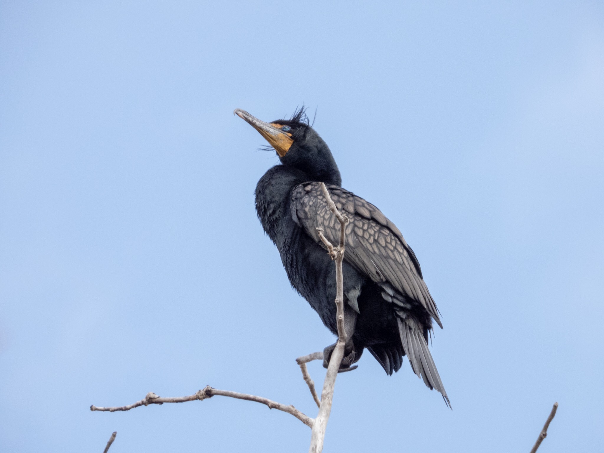

What is Project 366? Read more [here](https://thebirdsarecalling.com/2019/03/29/project-366/)!

I came across a single Double-crested Cormorant at Heritage Wetlands Park in Sherwood Park a few days ago. Cormorants tend to hang out in colonies so this is likely an early bird. eBird records show that up to 16 cormorants were recorded at this location last summer (in May) and that they start arriving around mid-April and stay until the end of September. The Double-crested Cormorants appear black form a distance but upon closer inspection, particularly if the light is right, one can see a subtle beautiful pattern emerge on their wings. It almost looks painted. This particular individual, lets call him/her Early Bird, was perched at the very top of a tall tree, almost as he/she wanted to show everyone "Check me out, I got here first!". One can also see that Early Bird has a bit of bad hair day, either that, or its a tad breezy way up there.

Nikon P1000, 935mm equivalent, 1/500s, f/5.6, ISO 320

_May the curiosity be with you. This is from “The Birds are Calling” blog ([www.thebirdsarecalling.com](http://www.thebirdsarecalling.com)). Copyright Mario Pineda._
