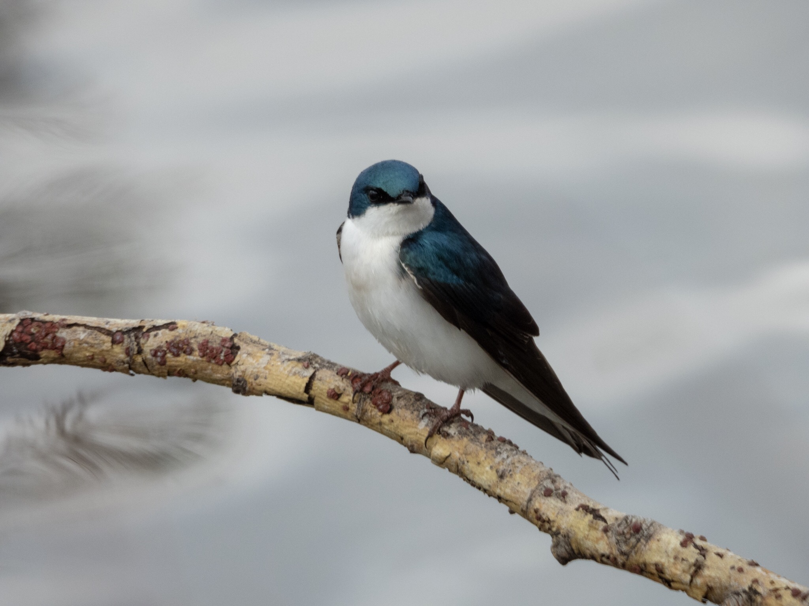

What is Project 366? Read more [here](https://thebirdsarecalling.com/2019/03/29/project-366/)!

Swallows can be tricky to id and photograph. They are small, always seem to be airborne, skipping back and forth at breakneck speeds, never stopping and seemingly never landing. During a field trip in southern Chile in December I found these swallows flying around above a pasture. Despite visiting the same field almost every day over the next few weeks I never managed to catch one perching. As a result I never got a good look at one and, needless to say, I was not able to id or photograph them. Using the process of elimination all I was able to do was to narrow it down to two possible species, either the [Chilean Swallow (](https://ebird.org/species/chiswa1)[_Tachycineta leucopyga_](https://ebird.org/species/chiswa1)[)](https://ebird.org/species/chiswa1) or the [Blue-and-white Swallow (](https://ebird.org/species/bawswa1)[_Pygochelidon cyanoleuca_](https://ebird.org/species/bawswa1)[)](https://ebird.org/species/bawswa1). Of course, this left me very dissatisfied but they were simply too small, too fast and the morphological differences between the two species were too subtle for me to be able to pinpoint the species. Fast forward 5 months and I spot my first swallow of the year at Heritage Wetland Park in Sherwood Park. As it turns out, Canadian swallows behave the same way as Chilean swallows. Skipping back and forth at breakneck speeds, never stopping, never perching and never sitting still. Even with a new camera and more birding and photography experience there was just no way for me to catch up with them. As I was standing at the edge of the pond pondering my conundrum I suddenly spotted a lonesome swallow sitting on a dead branch that was jutting out over the water surface. It only sat there for a few seconds before taking flight again. Now I had a lead, I immediately trained my camera on that branch; pre-focusing and adjusting all the settings. I waited and I waited. I lost my concentration and focus several times but after what appeared to be an eternity, there it was, a very pretty Tree Swallow (_[Tachycineta bicolor](https://ebird.org/species/treswa)_, Lifer: #107, AB Big Year: #56). It landed at the exactly same spot as last time. I don’t know if it the same individual or a different one that just happened to land on the same place. I did not care, it was the closes look I have ever got of a swallow. The wait was worth it.

Nikon P1000, 1310mm equivalent, 1/500s, f/5.6, ISO 160

_May the curiosity be with you. This is from “The Birds are Calling” blog ([www.thebirdsarecalling.com](http://www.thebirdsarecalling.com)). Copyright Mario Pineda._
