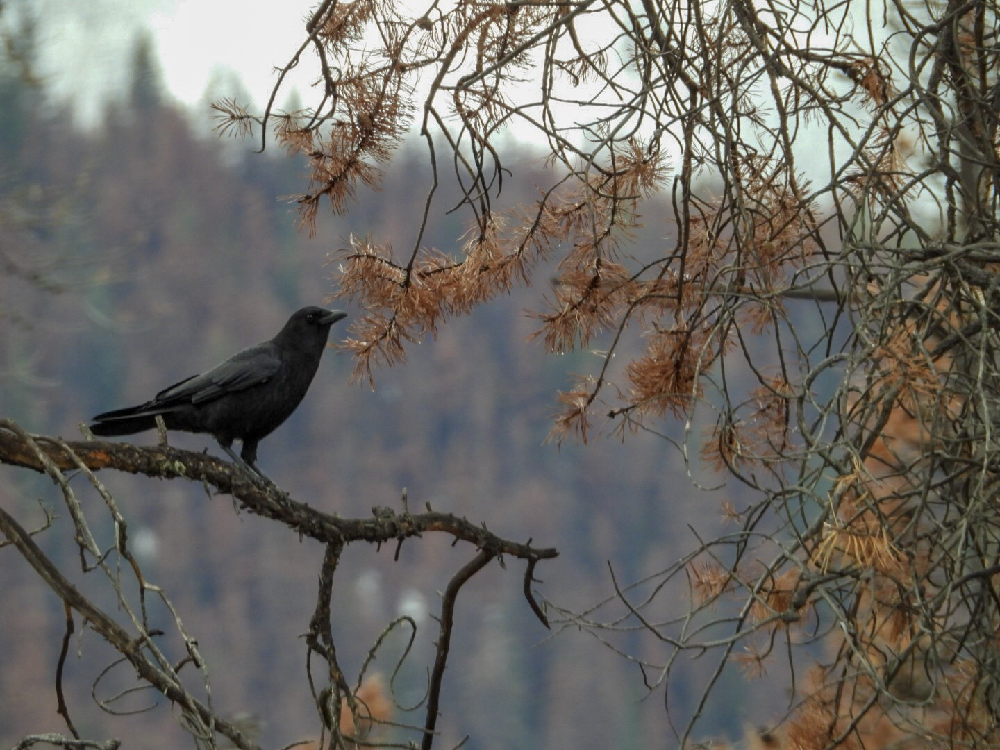

What is Project 366? Read more [here](https://thebirdsarecalling.com/2019/03/29/project-366/)!

There are many cultural depictions of black birds, such as ravens and crows, that associate these birds with ill omen and death. Clearly these are figments of peoples’ imaginations. Black birds are highly intelligent, uber cool, and ecologically important as they are ubiquitous, globally distributed and take on the roles of predator, prey and scavenger, all in one. This picture from Jasper National Park is emblematic of some of those darker cultural depictions that these birds sometimes are associated with. At first glance there may not be any apparent death or ill omen here, but upon closer inspection, the rust coloured needles of the surrounding pine forest, tell a different story. These “red tops” have succumbed to the mountain pine beetle. Over the last several decades this beetle has ravaged the pine forests of British Columbia, and more recently it has spread into Alberta. The underlaying reasons for this multi-decade epidemic are complex and multifarious with [books written about it](https://www.amazon.ca/Empire-Beetle-Killing-Americas-Forests/dp/1553655109/ref=nodl_). Without getting into details, the ultimate causes of this cataclysmic epidemic can all be attributed human arrogance, misguided policies, science illiteracy and greed.

Enough doom and gloom. Black birds are not always associated with ill omen and foreboding. In Native American culture the raven is viewed as a creature of metamorphosis, symbolizing change or transformation. I like to view this lone black bird as exactly that, a sign of the ongoing metamorphosis of the forests of western Canada. Right now it might be difficult to see beyond the destruction, but nature will prevail and out of the ashes of the red tops ecological succession will create new ecosystems and new opportunities that only time will tell. Personally, I am looking forward to the wild flowers that are expected to be one of the early colonizer.

As far as this one particular black bird hanging out in a forest of mountain pine beetle killed trees. The question is, is it a crow or a raven? As in American Crow vs. Common Raven. Typically the movement and vocalizations would give it away, but this fellow did neither. It just sat there. My first though was that the “curved bill” suggests it would be a raven. A consult with the folks at Edmonton Nature Club zeroed in on the overall shape and proportions being more consistent with a crow. In the end I am on the fence with this one.

Nikon P1000, 1100mm equivalent, 1/400s, f/5.6, ISO 400

_May the curiosity be with you. This is from “The Birds are Calling” blog ([www.thebirdsarecalling.com](http://www.thebirdsarecalling.com)). Copyright Mario Pineda._
