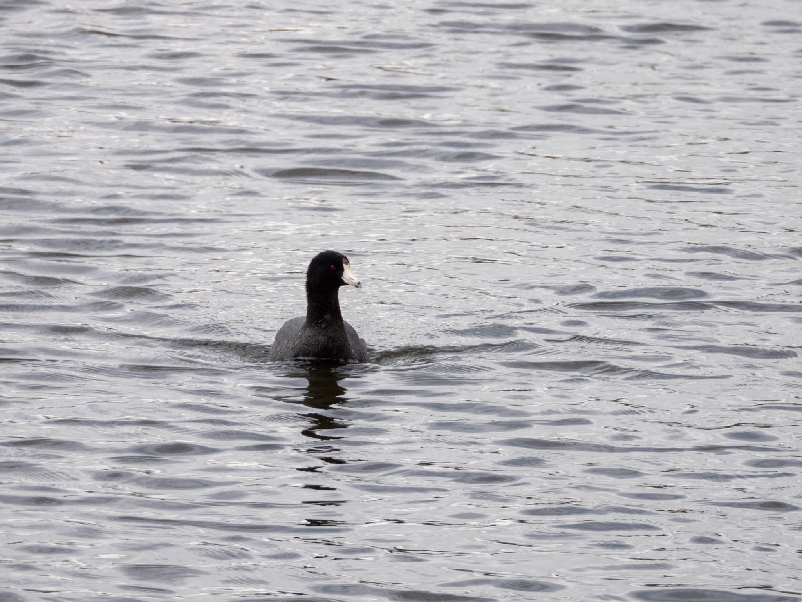

What is Project 366? Read more [here](https://thebirdsarecalling.com/2019/03/29/project-366/)!

Coots are cute and unmistakable, resembling plump aquatic chickens. This might explain why they are called poule d’eau in some parts of the world (which translates to water hen). This fella was chugging along like a little tug boat on one of the ponds at Heritage Wetland Park in Sherwood Park. It’s an American Coot and it is the only coot species that occurs in North America. This was my third coot species, with the previous two being the Red-gartered Coot and White-winged Coot, both observed in southern Chile. There are ten species of coots in the world, of which six live in South America. The six South American coots tend to be distributed on the western side of the continent, down south along the eastern part of South America and across Patagonia. The one common locality where all the six South American coots co-occur is Chile. So as far as I am concerned, here is yet one more good reason to go back to South America and Chile in particular, to top up my coot list.

_Nikon P1000, 470mm equivalent, 1/640s, f/5, ISO 100_

_May the curiosity be with you. This is from “The Birds are Calling” blog ([www.thebirdsarecalling.com](http://www.thebirdsarecalling.com)). Copyright Mario Pineda._
