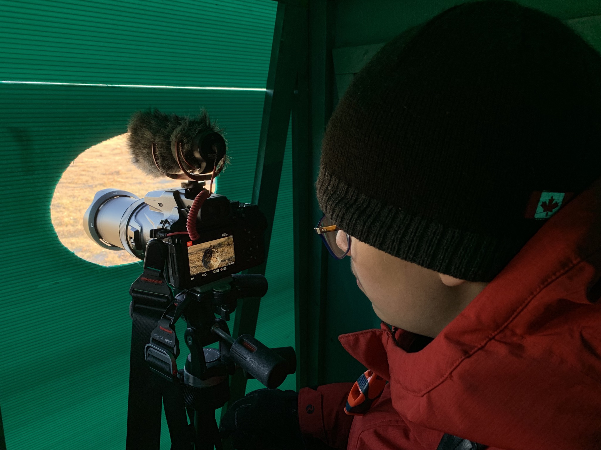

What is Project 366? Read more [here](https://thebirdsarecalling.com/2019/03/29/project-366/)!

The good great news is that yesterday, on May 4th, it was the [Global Big Day of Birding](http://www.news.cornell.edu/stories/2019/04/lab-ornithologys-global-big-day-bird-count-may-4). As it turned out, The Force was with us and the Big Day of Birding became the Big Weekend of Birding. It all started off with a whirlwind birding tour of central Alberta with the [Edmonton Nature Club](https://edmontonnatureclub.org/index.html), followed up with an predawn Sharp-tailed Grouse Tour with the [Wainwright Wildlife Society](http://www.wainwrightdistrict.org/wildlife/) and wrapped up with a mellow and quick tour of the pelicans of Sherwood Park. There will be separate blog posts about these adventures in the close future. The not so good news (it does not really qualify as bad news as it is sort of a good problem to have I guess) is that once I came home I quickly realised that I did not have a device capable of importing, processing and uploading all the images and videos from the weekend's adventures. All in all the weekend netted 500+ images and video clips with a combined size of about 15 GB. It is painfully obvious that my current workflow for processing images and video clips, which is the same one I used when my cell phone was my "camera", is completely inadequate to deal with the volume of images I am creating with the Nikon P1000. As it stands now, I cannot even access the images from this weekend as I first need to backup exiting images (which will likely take several days), create space on a suitable device by deleting old photos and then hopefully be able to start working with the new photos and videos. Oh, and I should probably also overhaul my workflow for processing photos and videos after a day of shooting, but that is an entire different story. As a result, the only new image available today is this teaser photo from inside the blind at the grouse tour, yes that is a female Sharp-tailed grouse that is being recorded as she is checking out the boys strutting their stuff. Consider this photo just a preview of things to come in the next little while, once I get my photos in shipshape.

iPhone_, 4.25mm, 1/120s, f/1.8, ISO 50_

_May the curiosity be with you. This is from “The Birds are Calling” blog ([www.thebirdsarecalling.com](http://www.thebirdsarecalling.com)). Copyright Mario Pineda._
