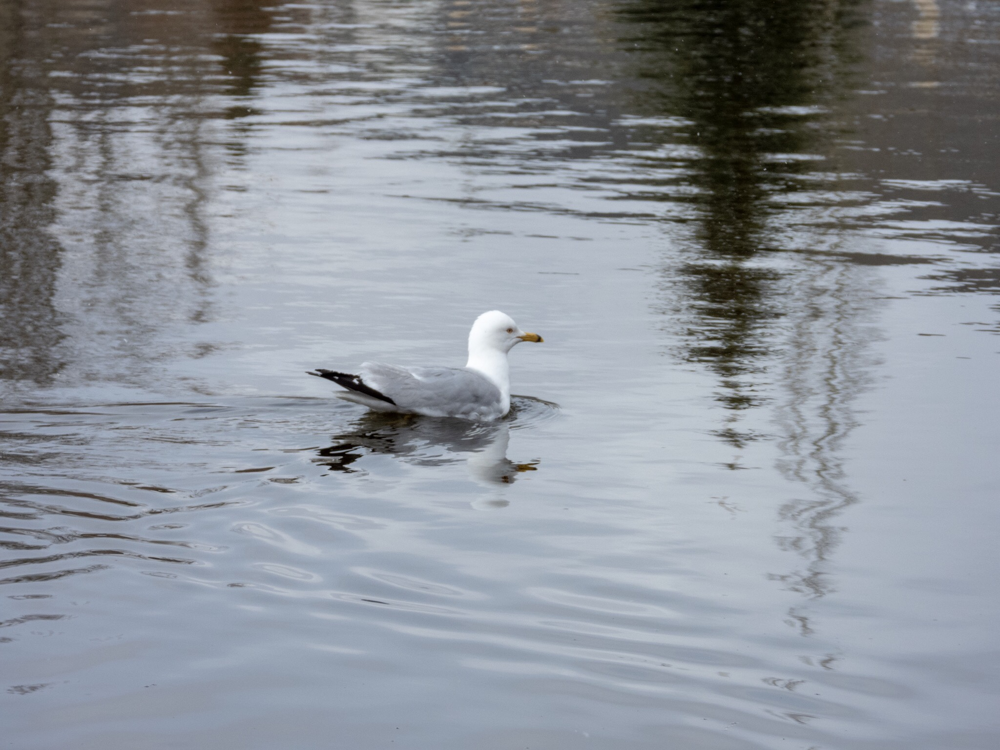

What is Project 366? Read more [here](https://thebirdsarecalling.com/2019/03/29/project-366/)!

The Ring-billed Gull is perhaps the most ubiquitous gull in these neck of the woods (Alberta, Canada and North America). Sometimes it gets a bad rap as it tends to hang out where people either have food (Granville Island outdoor plaza in Vancouver comes to mind) or where we dispose of our trash (think landfills). It has no problems stealing your hotdog if you are inattentive to your hotdog. These gulls are intelligent, highly social and opportunistic. Any animal with these traits is bound to be successful and deserves our respect and admiration. They are also quite beautiful if you just take your time to look at them. This handsome fella was swimming around in Heritage Wetlands Park in Sherwood Park the other day.

Nikon P1000, 235mm equivalent, 1/800s, f/4.5, ISO 100

_May the curiosity be with you. This is from “The Birds are Calling” blog ([www.thebirdsarecalling.com](http://www.thebirdsarecalling.com)). Copyright Mario Pineda._
