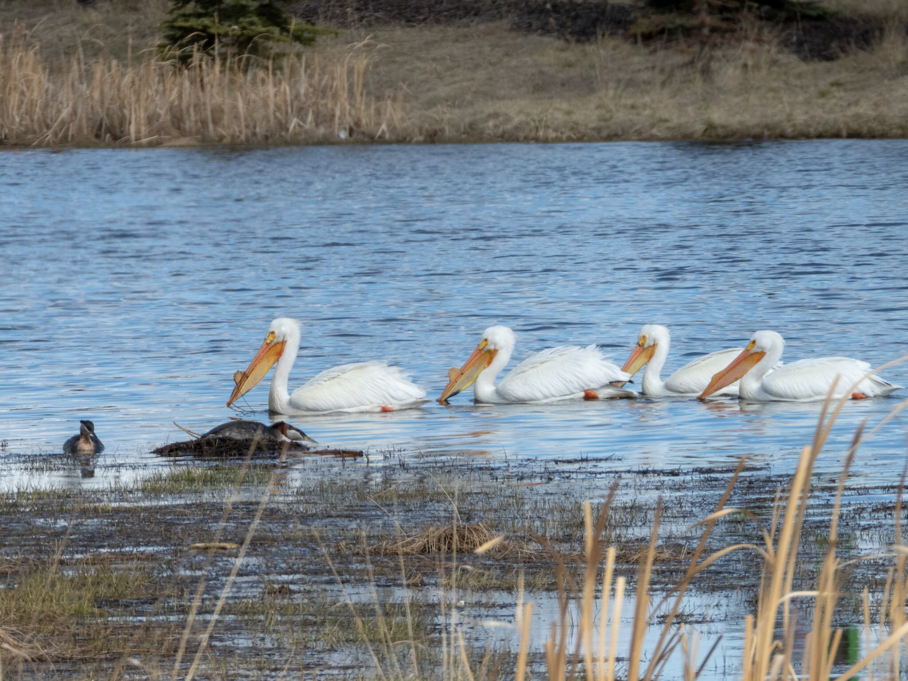

What is Project 366? Read more [here](https://thebirdsarecalling.com/2019/03/29/project-366/)!

I do not know much about the birding scene in the Calgary area yet, but judging from the birding-related Facebook feeds that I am following, Calgary seems to have a thriving birding scene with several hotspots that look really awesome, e.g. Inglewood Bird Sanctuary and Frank Lake. As Calgary is roughly 300 km south of Edmonton northward migrants tend to arrive there a few weeks earlier than in the capital. Over the last few months I noticed that Calgary acts as a birding early warning system, preparing us Edmonton birders for things coming our way. One of the migrants that arrived in Calgary over a month ago were the American White Pelicans (_[Pelecanus erythrorhynchos](https://ebird.org/species/amwpel)_). I have been looking forward to seeing this magnificent bird ever since I saw the first reported sightings of them in the Calgary area. They arrived here in the Edmonton a few weeks ago. Unfortunately, perhaps due to sloppiness on my behalf or just being a noob, I have been missing them on several occasions. The latest missed opportunity was [a week ago at Heritage Wetlands Park](http://thebirdsarecalling.com/2019/04/30/project-366-post-no-033-heritage-wetlands-park/), where, after several, hours of birding I came up empty handed on the pelican front. Once I came home and checked eBird, however, someone had reported seeing pelicans at that location the very same day. As I was bemoaning my lack of pelican luck, a fellow birder suggested that I check out Emerald Pond, a small pond behind Lowe’s in Sherwood Park. On our way back from our Big Weekend a few days ago we decided to make a stop at this pond. Sure enough, as we were parking a bird the size of a small airplane swooped down over the car and went in for a water landing on the pond. Once we sneaked our way down to the water’s edge we found four adult pelicans chugging along in the water. All four pelicans had horn like projections growing on their upper bills, indicating that they are breeding adults. They went along the shore of the pond, stopping to and from and fishing up aquatic vegetation. It looked like they were eating the aquatic plants growing along the reeds in the pond. While pelicans are omnivores I have not been able to find any information suggesting that they eat plants (but they seem to be happy to devour anything that has scales, fur or feathers, including pigeons and the odd chihuahua).

Birding keeps throwing me for loops. You can drive for an hour or more to the perfect birding spot, only to not see any bird at all. Or you can go to a small pond behind a big box store surrounded by busy roadways only to find the most amazing diversity of birds. In the 20 minutes we spend at the pond we saw 10 different species. There were the usual suspects, e.g. Canada Geese, Mallards, Ring-billed Gull, Franklin’s Gull. As we were about to leave a Common Golden eye came along, followed by a pair of Red-necked Grebes. When we were about to leave (second attempt) a squeaking Killdeer landed in the reeds and, out of nowhere, two Double-crested Cormorants came in for landing scaring the living bejeezus out of the merganser. On our drive home we were discussing what else we could have seen if we had stayed longer. We will definitely be back to this unassuming pond behind Lowe’s.

It was only as I was writing this post that I noticed that there are a pair of Red-necked Grebes next to the pelicans. One of the grebes looks like it is sitting on a mound. I am curious if this could be a nest. Yet another reason to head back sooner rather.

Nikon P1000, 605mm equivalent, 1/800s, f/5, ISO 100

_May the curiosity be with you. This is from “The Birds are Calling” blog ([www.thebirdsarecalling.com](http://www.thebirdsarecalling.com)). Copyright Mario Pineda._
