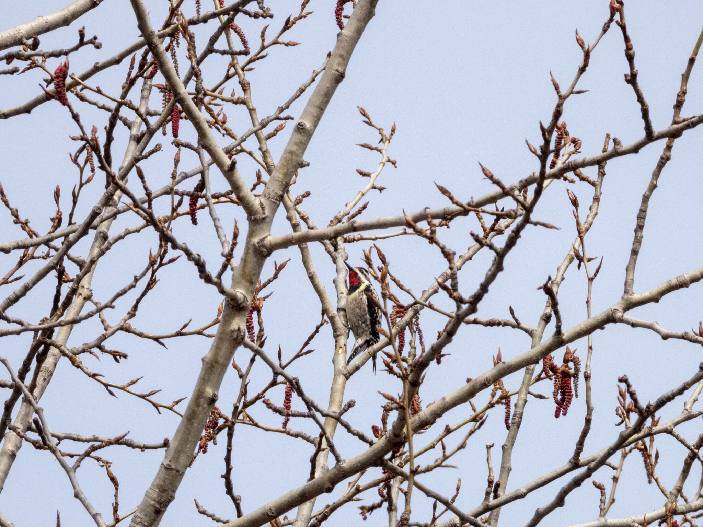

What is Project 366? Read more [here](https://thebirdsarecalling.com/2019/03/29/project-366/)!

Our last stop of the day during our Big Day of Birding tour with the Edmonton Nature Club was [Big Knife Provincial Park](https://www.albertaparks.ca/parks/central/big-knife-pp/) about 2 hours drive south east of Edmonton. The whole gang went for a walk through the forest, which was a nice change as we had spent most of the day doing in the car. This small provincial park straddles the Big Knife Creek, [named after a fight to the death between “Knife”, a member of the Blackfoot tribe, and “Big Man” of the Cree tribe](https://www.albertaparks.ca/media/3193706/Big_Knife_biophys_1999_rept.pdf). I have not been able to find out why there were fighting, but clearly it must have been something of great importance. During our nature walk we found 15 species of birds, including a bunch of firsts (first of the year and first in our life); including the Great Blue Heron (_[Ardea herodias](https://ebird.org/species/grbher3)_), Broad-winged Hawk (_[Buteo platypterus](https://ebird.org/species/brwhaw)_), Eastern Phoebe (_[Sayornis phoebe](https://ebird.org/species/easpho)_), and the diminutive Golden-crowned Kinglet (_[Regulus satrapa](https://ebird.org/species/gockin)_). As we were leaving we came across a Yellow-bellied Sapsucker (_[Sphyrapicus varius](https://ebird.org/species/yebsap)_, Life: #145 , AB Big Year: #96) hard at work drilling sap wells high up in a lattice of branches. Unlike other woodpeckers, Sapsuckers do not look for insects to eat in dead trees. Instead they make, and maintain, sap wells and use the sap as their main food source, just like humans utilize the sap from maple trees for maple syrup. These sap wells must be continuously maintained so that the sap continues to flow. It had a rather scruffy appearance, like someone that just rolled out of bed in the morning after a few days without showering. I have been told, however, that that’s how sapsuckers roll it.

Nikon P1000, XXXmm equivalent, 1/Xs, f/X, ISO XXX

_May the curiosity be with you. This is from “The Birds are Calling” blog ([www.thebirdsarecalling.com](http://www.thebirdsarecalling.com)). Copyright Mario Pineda._
