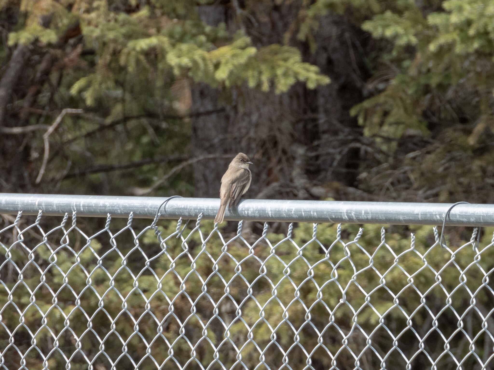

What is Project 366? Read more [here](https://thebirdsarecalling.com/2019/03/29/project-366/)!

It was not until I saw my first Eastern Phoebe (_[Sayornis phoebe](https://ebird.org/species/easpho)_) that I even knew there was bird with this name. In my “pre-Phoebe” days Phoebe was a synonym for Lisa Kudrow in the sitcom Friends. The Eastern Phoebe is an unassuming small songbird, and if it would not have been hanging out on a fence I would likely have completely missed it. I managed to snap a picture of it before it flew of into the shrubbery. One can clearly see distinct “peaked head” which is due to the bird rising its feathers on top of its head. Based on submitted observations to eBird the Eastern Phoebe is at the eastern margin of its range here in Alberta, with the main part of its distribution being in central and eastern parts of the continent. We saw this bird at the tail end of our central Alberta tour with the Edmonton Nature Club during Global Big Day of Birding on May 4. The phoebe was the first bird we saw as soon as we pulled into the parking lot at Big Knife Provincial Park. It became bird #146 on our life list and #97 on our AB Big Year list.

Nikon P1000, 1100mm @ 35mm, 1/500s, f/5.6, ISO 125

Same picture, just postprocessed and cropped in Lightroom

_May the curiosity be with you. This is from “The Birds are Calling” blog ([www.thebirdsarecalling.com](http://www.thebirdsarecalling.com)). Copyright Mario Pineda._
