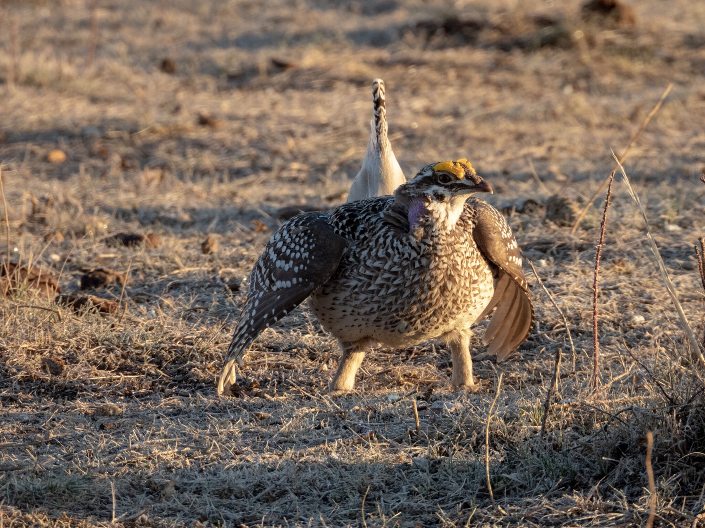
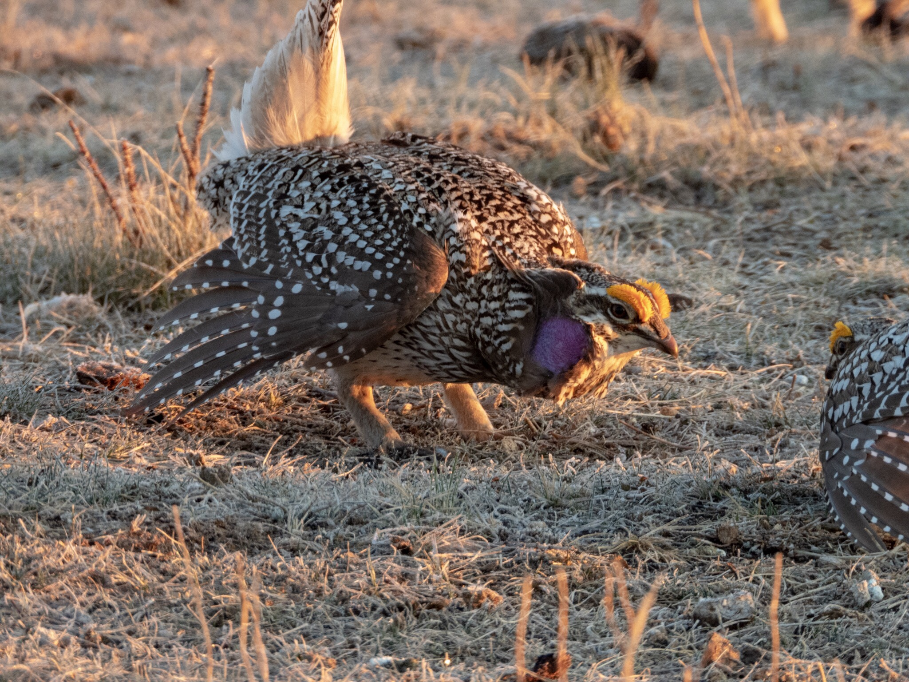
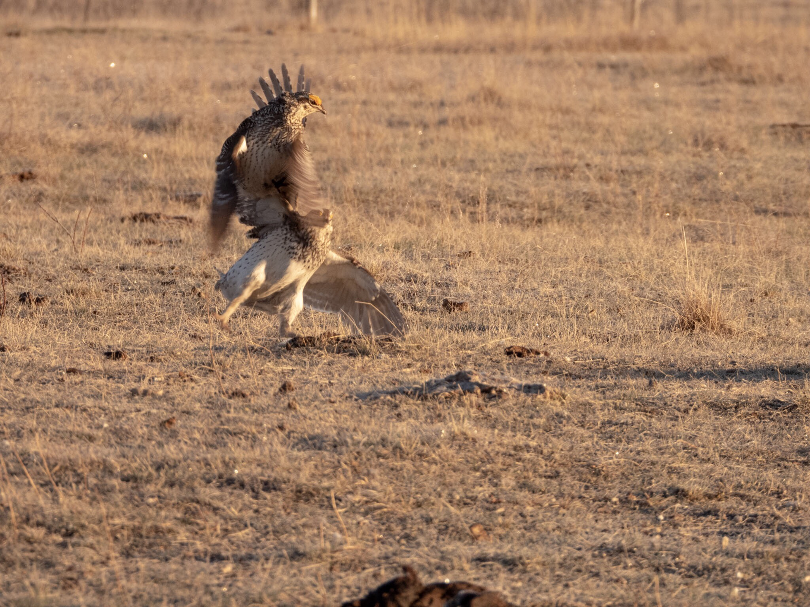
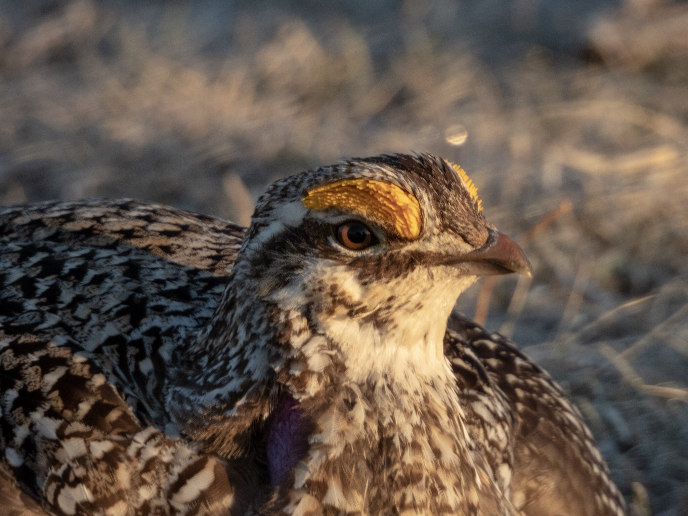
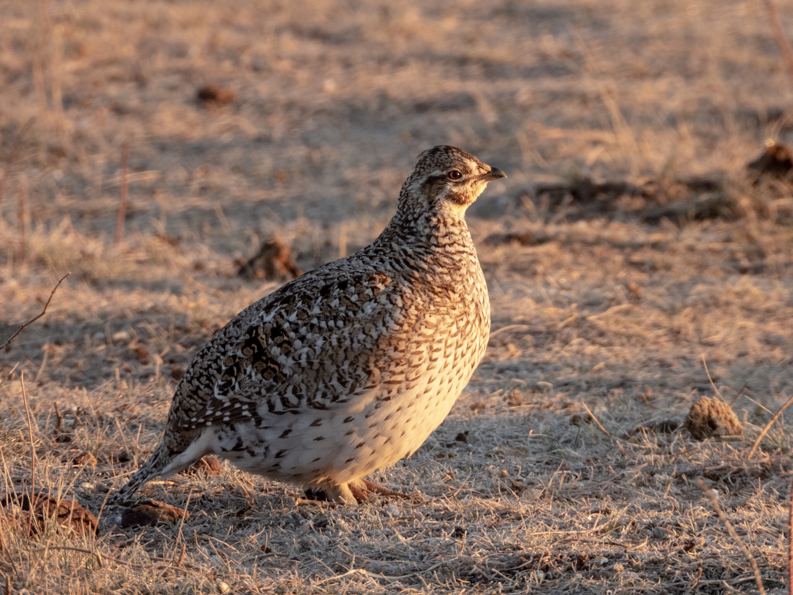
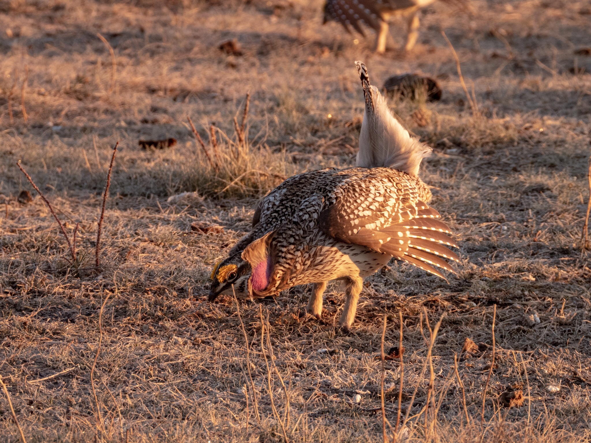
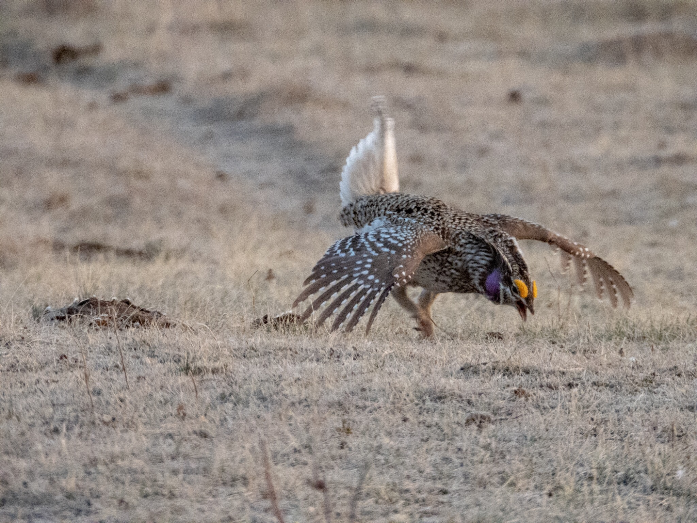
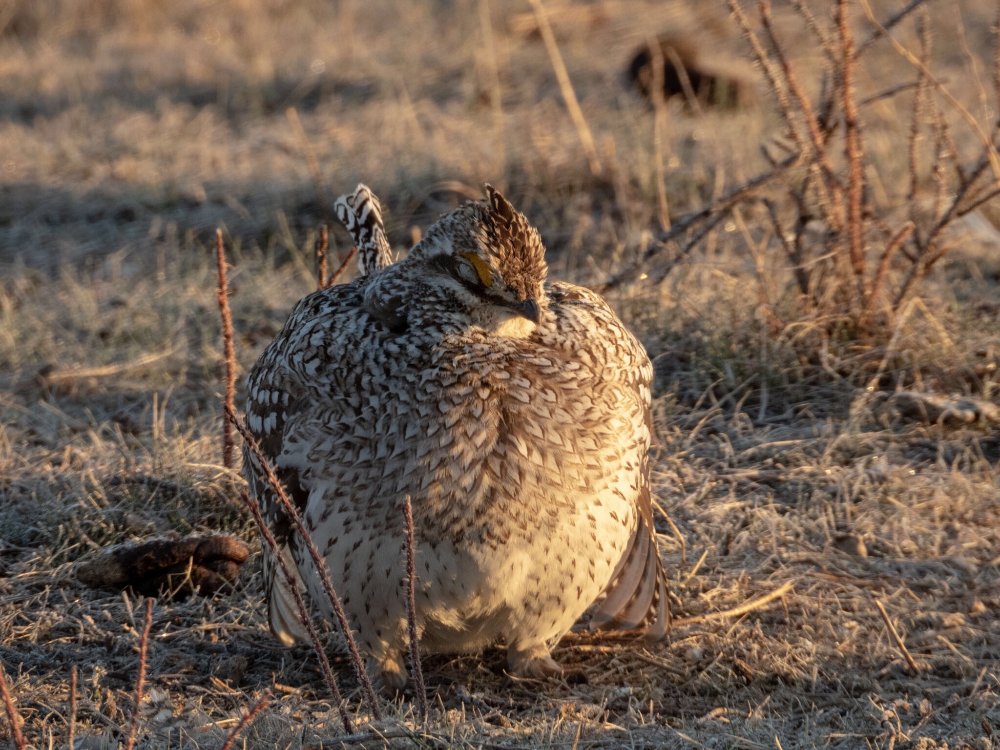
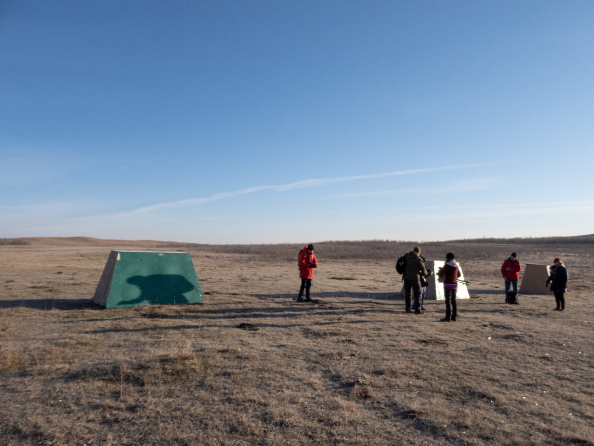

After spending the day with [Edmonton Nature Club](https://edmontonnatureclub.org/index.html) chasing birds across central Alberta during the [Global Big Day of Birding](https://ebird.org/news/global-big-day-4-may-2019) we ended up in Wainwright on Saturday evening. The plan was to spend the night in Wainwright and go on a Sharp-tailed Grouse tour the next day organized by the [Wainwright Wildlife Society](http://www.wainwrightdistrict.org/wildlife/).

The alarm clock went of the next morning in the middle of the night at 3:45. At 4:30am we rolled in at the dimly lit Canadian Tires parking lot to meet up with our tour guide and the rest of the grouse afictionados. We were 8 people and our guide Randy, a local born, raised and well-aged Wainwrightian. Once everyone had arrived the convoy rolled out into the empty streets of Wainwright. A few minutes later we left the last outpost of civilization behind us as we took a narrow road heading dead south across the Canadian Forces Base. We traveled at high speeds down desolated country roads, enveloped by the impenetrable black night. Occasionally an animal scurried across the road. It was like a scene out of a movie - surreal, secretive and very exciting. About half an hour later, as the first rays of light started to creep across the horizon, the lead car slowed down and pulled off on to a non-existing path in the tall brush. We drove slowly a few hundred meters across the field until we were out of sight from the main road. After parking and regrouping Randy gave us the low-down on the viewing protocol: enter the blinds quietly and quickly, stay in the blinds during the entire viewing period, use bathrooms before entering the blind, keep the location to yourself and stay warm. It was definately chilly with the vegetation covered in frost, so that last advice could be a challenge.

It was only a few minutes walk over the crest of a low hill to get to the the blinds. As soon as we had cleared the hill the blinds came into view and we realized that the party already was in full swing. Three small box shaped blinds were lined up on the field. In front of the blinds there were already several dozen grouse moving around and making squeaking and cooing sounds. As we approached most of the grouse flew off, but surprisingly enough not all of them. Perhaps they were used to the drill. The blinds were small and only had sitting room on wooden benches. We crammed ourselves and all our gear into one of the blinds and closed the hatch. The blinds had cutouts on the front for viewing and for poking the camera lenses out. With four adults and camera gear in the blind it was cosy to say the least and the only wiggle room was whatever room your toes head in the boots.

We counted a total of 35 Sharp-tailed Grouse on the field in front of the blinds, some right outside the blind and up a radius of about 30 meters from where we were sitting. The display grounds, called a lek, were covered by short native grass that looked like it had been grazed. The large turds on the dance floor suggested that cattle could be grazing here. The lek was surrounded by taller grass and shrub that could provide cover for the grouse if a predator would show up and crash the party.

A male ready to impress the ladies.

As we settled in we soon realized that the there was a definitive rhythm to the display. Periods of display was intermittently punctuated with everyone stopping and freezing. It resembled musical chairs, where individuals get eliminated as the game progresses. Instead of competing for chairs, however, the male grouse are competing for the attention of females. It was not clear which individuals paired up. All the males looked great to us and the females were strolling around with a sort of indifferently dignified coolness. We did not see any mating taking place in the lek so there might be a separate location for the hanky-panky, perhaps in the tall brush surrounding the lek.

Two males sizing each other up.

Occasionally a dance-off between two males results in a physical altercation where the males lunged towards each other clashing midair. The males are trying to establish dominance of the lek by intimidating other males and I guess sometimes you just got to roll up your sleeves and get the job done.

The males have bushy yellow eyebrows making them look like real macho grouse that mean serious business.

It’s easy to tell the difference between the males and the females. Females are more plain looking and lack the bushy yellow eye brows and the purple patch on their throat. Also, contrary to most humans, the females do not dance. They just hang out on the lek observing the males. The females are looking for a male that can hold the dominant position within the lek. The male that can pull off that feat is likely going to be a toughest bird in the bunch.

Plump Sharp-tailed Grouse lady looking for love.

It is obvious where the Sharp-tailed Grouse gets its name from - from the sharp pointy tail that they rattle as they dance.

Macho grouse male looking for love.

The males’ lekking behaviour involves spreading out their wings, stomping their feet rapidly and forcefully, and rattling their tail feathers while moving around in circles. Males do this tail-rattling in synchrony with each other in between periods when they stop and pose for the females and size each other up.

Getting down giving it your all.

One tired grouse boy after a long night trying to impress the girls.

After about two hours, around 7am, things had slowed down substantially. Most of the females had left by this time leaving mostly males in the lek area. Perhaps not surprisingly, once the females had left, the males stopped displaying and were just passively sitting on the field. Randy informed us that these are traditional lekking grounds. The grouse return to the same lek location each year. With a radius of only about 20-30 metres we were trying to figure out what made this lek location special. After all, on a big open field, what makes one location any different from another one? From a human perspective, there does not seem to be anything unique about the location the grouse have chosen for their lek. Maybe one has to think like a grouse to fully understand the significance of the location.

After the tour we went to the [The Two Old Men](https://m.facebook.com/2oldguysrestaurant/) at the Wainwright train station for a well-deserved breakfast with Randy. Perhaps not surprisingly, the place was run by..., two old men.

The Sharp-tailed Grouse was Lifer: #150 and AB Big Year: #101. It was an awesome experience and the icing on the cake on our Global Big Day tour the previous day. The grouse lek season is coming to an end in the next few weeks, but we are already planing to go and view them next year again. In the meantime I leave you with this video clip of the action from last Saturday.

https://youtu.be/1JFDjqrZ\_Rw

_May the curiosity be with you. This is from “The Birds are Calling” blog ([www.thebirdsarecalling.com](http://www.thebirdsarecalling.com)). Copyright Mario Pineda._
