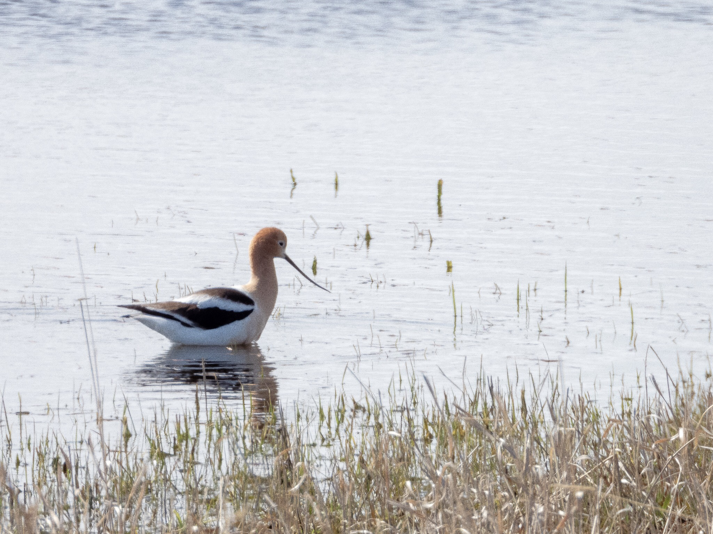

What is Project 366? Read more [here](https://thebirdsarecalling.com/2019/03/29/project-366/)!

One of the stops during our Big Day tour of central Alberta with Edmonton Nature Club was Lyseng Reservoir. This 564-acre site is located approximately 60 km southwest of Edmonton and consists of upland, riparian and wetland habitat. During our Big Day tour we drove along the southern edge of the reservoir, stopping repeatedly as more and more birds appeared. The place was just bursting at the seams with birds. In less than 40 minutes we observed 28 different species, many of which were shore birds (all new to us), but also a handful of raptors (including a Great Horned Owl), a gaggle of different geese species and other miscellaneous goodies. One of our lifers here was the funky looking American Avocet (_[Recurvirostra americana](https://ebird.org/species/ameavo)_, Life: #133, AB Big Year: #83) which has the notable distinction of being my first bird ever with an upturned bill. A number of these were wading along the shallow shoreline looking for a morsel to eat. Looking at the recorded observations at eBird reveals that central Alberta is the Northern margin of its distribution. This is a story that seems to be repeating itself. In yesterday’s post a similar eBird analysis revealed that Alberta is at the western margin of the Eastern Phoebe’s distribution (at least in Canada, it seems to go more westward further south). It may be that latitudinally (central) Alberta is the northern margin for many southern species with the American Avocet being one example, perhaps because of the long and cold winters. Longitudinally Alberta appears to be at the western margin of species such as the Eastern Phoebe, perhaps because of the Rocky Mountains are a physical barrier. This is all just a theory though and I have not googled it or consulted any experts. If I am right, however, remember “that is my theory, that is to say, which is mine,... is mine.” (To paraphrase Miss Anne Elk from the Monty Python sketch on [Anne Elk’s Theory on Brontosauruses](https://youtu.be/Xs7r5xfucPs)).

Nikon P1000, 806mm @ 35mm, 1/500s, f/5.6, ISO 110. Postprocessed and cropped in Lightroom.

_May the curiosity be with you. This is from “The Birds are Calling” blog ([www.thebirdsarecalling.com](http://www.thebirdsarecalling.com)). Copyright Mario Pineda._
