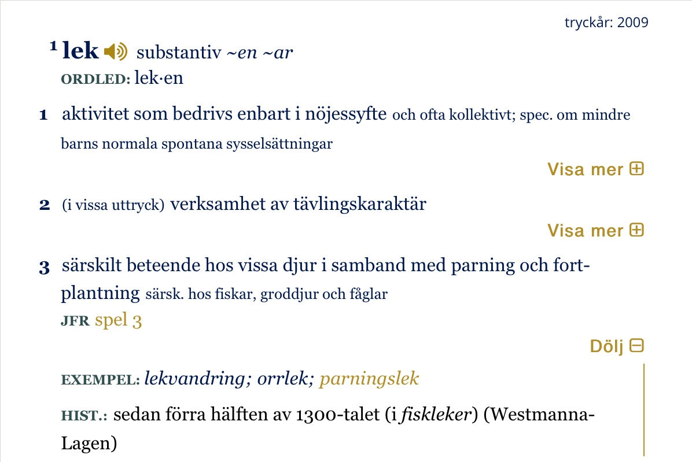
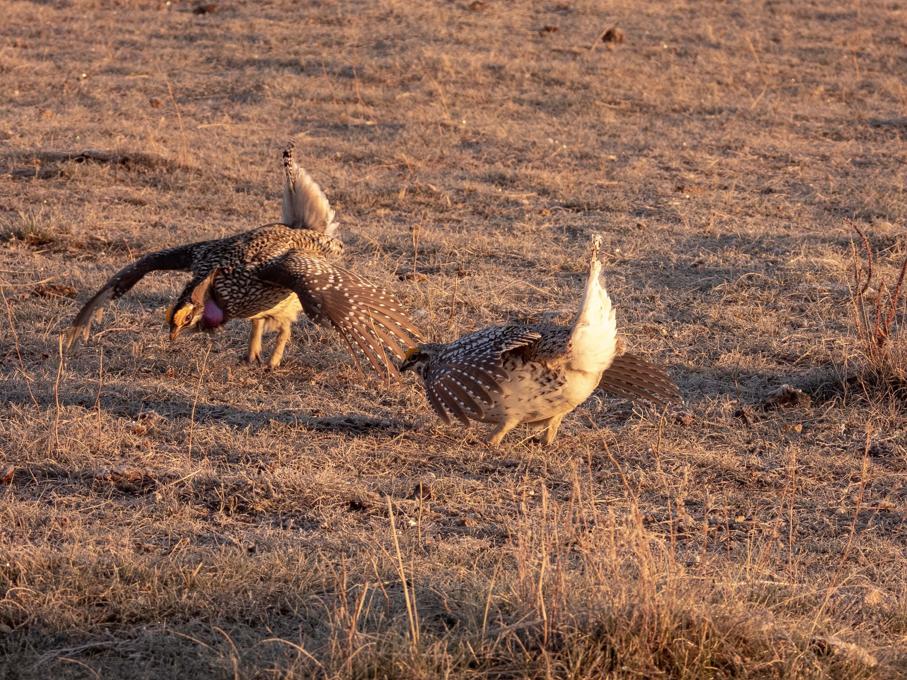

What is Project 366? Read more [here](https://thebirdsarecalling.com/2019/03/29/project-366/)!

After my latest post on the [Sharp-tailed Grouse Lek tour](http://thebirdsarecalling.com/2019/05/10/sharp-tailed-grouse-lek-tour/) my better half and biggest fan pointed out that the word “lek” looks like the Swedish word “lek” which means “to play”. Yes, she is fluent in Swedish and that is only one of her many amazing qualities.

A bit of research reveals that indeed she is right. The word was introduced from Swedish into the English language by the Welch-born amateur naturalist Llewelyn Lloyd who spend a few decades in Sweden studying and writing about all manners of natural history, in particularly ornithology. It appears that the Swedish word lek first appeared in his 1867 book _[The game birds and wild fowl of Sweden and Norway](https://books.google.ca/books/about/The_Game_Birds_and_Wild_Fowl_of_Sweden_a.html?id=SEd-EgZE2AgC&printsec=frontcover&source=kp_read_button&redir_esc=y)_. Getting your hands on this book in the olden days would have been a royal pain in the tail feathers, but these days it turns out that the entire book has been digitized and made [available for free online](https://books.google.ca/books/about/The_Game_Birds_and_Wild_Fowl_of_Sweden_a.html?id=SEd-EgZE2AgC&printsec=frontcover&source=kp_read_button&redir_esc=y). In Chapter 2 the breeding behaviour of the [Capercaillie](https://ebird.org/species/wescap1), which belongs to the same family as the Sharp-tailed Grouse (Phasianidae), are discussed and this is the first time the Swedish term _lek-ställe_ is introduced. Loyd defines _lek-ställe_ (play place) as the “locality where affairs matrimonial are carried on”. In the same paragraph he also introduces the term _lek-tid_ (play time) as the “pairing season”. It appears that over the years _lek-ställe_ has been shortened to simply lek.

The question is how did the Swedish word “to play” (as in child play) end up going from “child play” to “adult play”? According to Svenska Akademiens Ordlista, which is the undisputed authoritative and comprehensive Swedish language dictionary (analogous to what the Oxford English Dictionary is to the English language) the [word lek means](https://svenska.se/saol/?id=1711817&pz=7):

What was that? You don’t speak Swedish? Well, I feel sorry for you, but ok, in English then: 1) _activity that is conducted solely for pleasurable purposes (particularly child’s play)_, 2) _activities of a competitive nature_, 3) _particular behavior in some animals in conjunction with mating and reproduction, e.g. in fish, amphibians and birds (since 1300 century)._ I was not aware of that last significance of the word in Swedish, then again the last time I use this word in a Swedish context was probably when I was wee tyke (or possibly when my tyke was wee), so there you have it.

On a different note, lek is not the only Swedish word that made it into Lewelyn Loyd’s book. He quite merrily mixes Swedish (and Norwegian) terms into the narration pretty haphazardly. For example: Troll-Foglar, kasse, nät, förtrollning, hällristningar, barrskogar, flytta, förflytta sig, spel etc. (It is left as an exercise for the reader to figure out what these words mean) The unofficial linguistic term for the habit of mixing English and Swedish in the same sentence is Swenglish and it is commonly but typically unbeknownst practiced in North American IKEA stores.

When I was a tyke we always asked our friends “Vill du leka?” (Do you want to play?) and in my youthful innocence I was never aware of any other meaning of the word. Thanks to our experience with the Sharp-tailed Grouse our Swedish and English vocabularies have become enriched. Now I can use the word again, this time with my better half..., [Vill du leka ikväll?](https://www.google.com/search?rlz=1CDGOYI_enCA626CA626&hl=en-US&q=translate+vill+du+leka+ikväll?+to+english&spell=1&sa=X&ved=2ahUKEwiQ1eS0v5TiAhU-JzQIHWQ2DSYQBSgAegQIChAC&biw=414&bih=719&dpr=2)

Nikon P1000, 235mm @ 35mm, 1/250s, f/4.5, ISO 200. Postprocessed in Lightroom.

_May the curiosity be with you. This is from “The Birds are Calling” blog ([www.thebirdsarecalling.com](http://www.thebirdsarecalling.com)). Copyright Mario Pineda._
