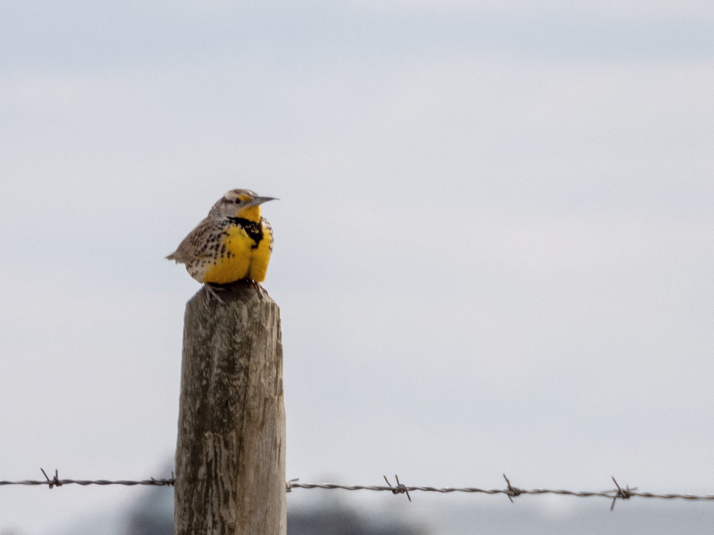

What is Project 366? Read more [here](https://thebirdsarecalling.com/2019/03/29/project-366/)!

Meadowlarks are handsome and eye-catching birds that are common in grassland and farmland. The male has a predisposition to perch on fence posts and sing his heart out. Our first meadowlark was the Long-tailed Meadowlark (_[Leistes loyca](https://ebird.org/species/lotmea1)_) in the province of Araucania in southern Chile two days after Christmas last year. We found it sitting on a fence post by a grassy field overlooking Lago Budi while it was serenading. Fast forward 4 months and 11000km to the North on a dusty country road in the outskirts of Camrose. Its the Global Big Day of Birding and we are travelling in a convoy with the birding contingent of the Edmonton Nature Club. On a fence post along a stubble field next to a Hutterite colony (you can see the dark outline of the colony buildings in the background) we spot our second meadowlark species, the Western Meadowlark (_[Sturnella neglecta](https://ebird.org/species/wesmea)_). Both species have the characteristic pointy bills and exhibit exactly the same behaviour; weakness to perch on fence posts and the typical meadowlark singing posture where they point their head upwards as they vocalize. Meadowlarks can be found in the Americas and interestingly all the North American species (2-3 species, depending on how you are counting) are yellow breasted while all the South American species (5 species) are red breasted.

Nikon P1000, 868mm @ 35mm, 1/800s, f/5.6, ISO 100. Postprocessed and cropped in Lightroom.

_May the curiosity be with you. This is from “The Birds are Calling” blog ([www.thebirdsarecalling.com](http://www.thebirdsarecalling.com)). Copyright Mario Pineda._
