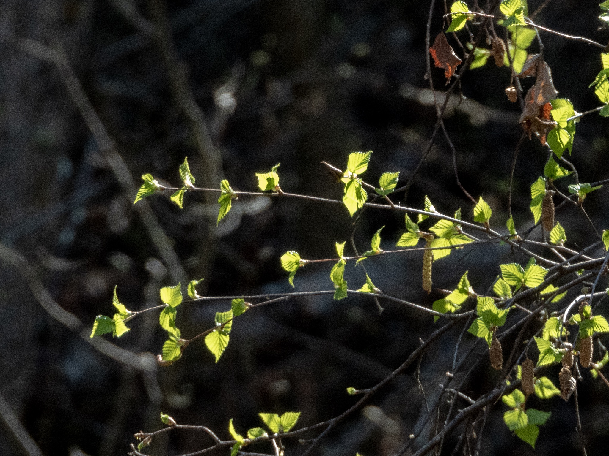

What is Project 366? Read more [here](https://thebirdsarecalling.com/2019/03/29/project-366/)!

I have to admit there were days when I though this day would never come. The fact that the first day of spring technically was on March 20 almost seems like a cruel joke here in central Alberta. Its mid-May and it has not been until the last few days that we saw the first few green leaves bursting out. If white is the colour of winter, then the colour of budding foliage must be the colour of spring. This is not just any colour of green, it is a light, airy, fresh and rejuvenating color. Artist have a name for this particular hue of green - sap green. [Some plain-air painters](https://www.itis.gov/servlet/SingleRpt/SingleRpt?search_topic=TSN&search_value=179033#null), in particular, prefer sap green for foliage because it is a warm, yellow green that mixes well for sunlight-infused trees.

Sun-infused objects make great subjects for photography. Today was a gorgeous sunny evening and it would have been criminal to spend it indoors. Said and done. After work I went out to Heritage Wetlands in Sherwood Park for some evening birding around the ponds. All in all, it was a great success with 23 species, including 4 lifers (indicated by \*). I also managed to get a bunch of decent pictures of many of the species. After 6 weeks with the Nikon P1000 I am finally starting to feel that I am able to tame this beast of a camera.

> Sherwood Park--Heritage Wetlands Park, Edmonton, Alberta, CA  
> 13-May-2019 6:13 PM - 8:10 PM  
> Protocol: Traveling  
> 3.389 kilometer(s)  
> 22 species (+1 other taxa)  
>   
> Canada Goose (Branta canadensis)  2  
> American Wigeon (Mareca americana)  2  
> Mallard (Anas platyrhynchos)  10  
> Redhead (Aythya americana)  4  
> Ruddy Duck (Oxyura jamaicensis)  10  
> Red-necked Grebe (Podiceps grisegena)  3  
> American Coot (Fulica americana)  4  
> gull sp. (Larinae sp.)  1  
> Common Tern (Sterna hirundo)  5 \*  
> American White Pelican (Pelecanus erythrorhynchos)  2  
> Northern Flicker (Colaptes auratus)  2  
> Eastern Phoebe (Sayornis phoebe)  1  
> American Crow (Corvus brachyrhynchos)  3  
> Common Raven (Corvus corax)  2  
> Purple Martin (Progne subis)  4 \*  
> Tree Swallow (Tachycineta bicolor)  4  
> Black-capped Chickadee (Poecile atricapillus)  2  
> American Robin (Turdus migratorius)  3  
> White-crowned Sparrow (Zonotrichia leucophrys)  1 \*  
> Song Sparrow (Melospiza melodia)  1  
> Red-winged Blackbird (Agelaius phoeniceus)  30  
> Common Grackle (Quiscalus quiscula)  1 \*  
> House Sparrow (Passer domesticus)  3

Nikon P1000, 868mm @ 35mm, 1/500s, f/5.6, ISO 360. Postprocessed and cropped in Lightroom.

_May the curiosity be with you. This is from “The Birds are Calling” blog ([www.thebirdsarecalling.com](http://www.thebirdsarecalling.com)). Copyright Mario Pineda._
