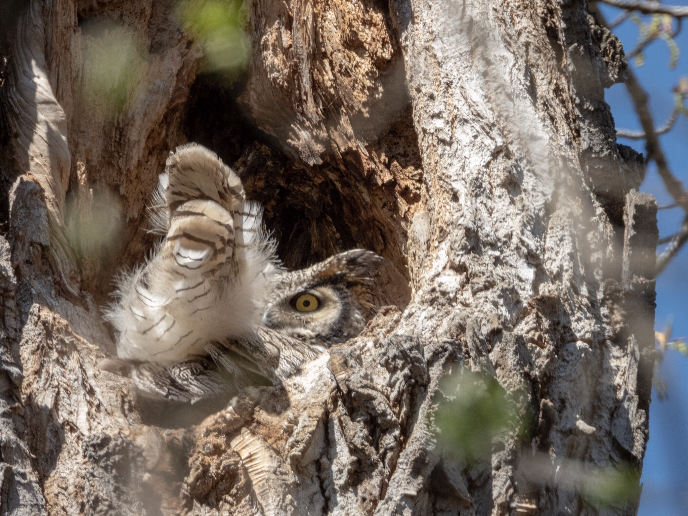

What is Project 366? Read more [here](https://thebirdsarecalling.com/2019/03/29/project-366/)!

The female Great Horned Owl down at the Whitemud Ravine has now been holed up in her tree for 2 months (that’s 60 days folks). There is reliable intelligence (i.e. picture evidence) showing that her eggs now have hatched and that she has at least two adorable fuzzy chicks. I went down to check out the new family on Mother’s Day (last Sunday). It was a beautiful and sunny spring day and lots of people were out on the trails. The trail was busy with adults and kids walking and biking, dogs taking their owners for a walk and the occasional mandatory fitness buffs. I was surprised to find no other birders or photographers were at the nest site. Mom owl was in her nest, with her tail feathers sticking out. Dad owl was nowhere to be seen but the occasional hooting from inside the forest provided reassurance that he was around. I set up my gear and got to try out my new ultra-portable tripod, the [JOBY GorillaPod 3K Video PRO](https://joby.com/ca-en/gorillapod-3k-video-pro-jb01562-bww/) with the Nikon P1000. As my mode of transport was my bike I did not want to pack the full sized tripod. The GorrillaPod performed commendable and had no trouble managing the hefty P1000. Of course a lone photographer with a camera pointed skyward attracts attention and it was not long before I had quite a gathering of spectators squinting against the bright sky trying to figure out what I was photographing. Everyone gets super happy and impressed when they are told about the nest with Great Horned Owl mom and her chicks. Owl mom seemed to be sleeping until an overly excited dog came running down the trail, barking and yapping like its life depended on it. Immediately a big yellow eye appeared in the nest scanning the horizon watchfully. She owl did not move a feather but her ever watchful eye was keeping close tabs on our activities below. I did not see the chicks that day, but I spend a long time at the nest taking photos, watching for the dad (which I never spotted, only heard) and talking to people about the owl family. Today’s photo was shoot through the emerging foliage. Your can see a few fuzzy green blobs of leaves bursting out after a long winter.

Nikon P1000, 1000mm @ 35mm, 1/500s, f/5.6, ISO 200. Postprocessed and cropped in Lightroom.

_May the curiosity be with you. This is from “The Birds are Calling” blog ([www.thebirdsarecalling.com](http://www.thebirdsarecalling.com)). Copyright Mario Pineda._
