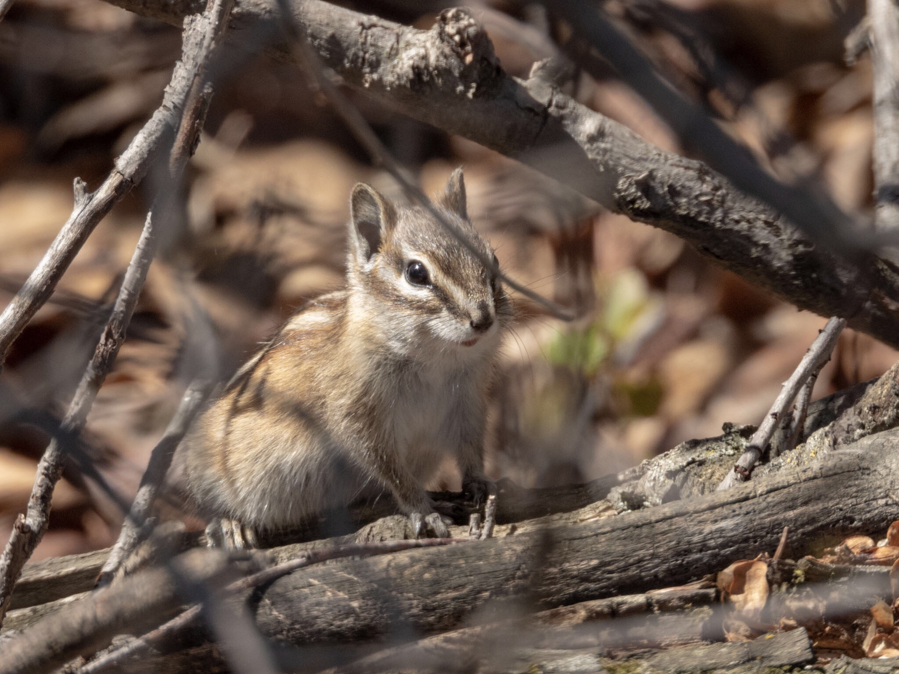

What is Project 366? Read more [here](https://thebirdsarecalling.com/2019/03/29/project-366/)!

Last Sunday I went on my first bike field trip down to the Whitemud Ravine and through the river valley. It takes a bit of practice to bike, and, at the same time, be ready to bird and take pictures. Where do your keep your binoculars, camera and notebook while biking? You want this gear to be accessible yet out of your way while biking. Hanging the binoculars and camera around your neck does not work so well when on a bike. Still working on the logistics of that, but I am looking forward to doing more bike birding, or nature biking during the summer. The first critter I encountered when I arrived at the ravine was this diminutive Least Chipmunk (_Neotamias minimus_) scampering through the understory. He was bit apprehensive of the large critter staring at him and making weird noise (that would be me) yet too curious to just run away without checking out what the commotion was about. The Least Chipmunk is the smallest species of chipmunk and the most widespread in North America. These chipmunks are diurnal (primarily active during the daytime), which is probably a good idea considering the nearby Great Horned Owl family.

Nikon P1000, 1000mm @ 35mm, 1/500s, f/5.6, ISO 250. Postprocessed and cropped in Lightroom.

_May the curiosity be with you. This is from “The Birds are Calling” blog ([www.thebirdsarecalling.com](http://www.thebirdsarecalling.com)). Copyright Mario Pineda._
