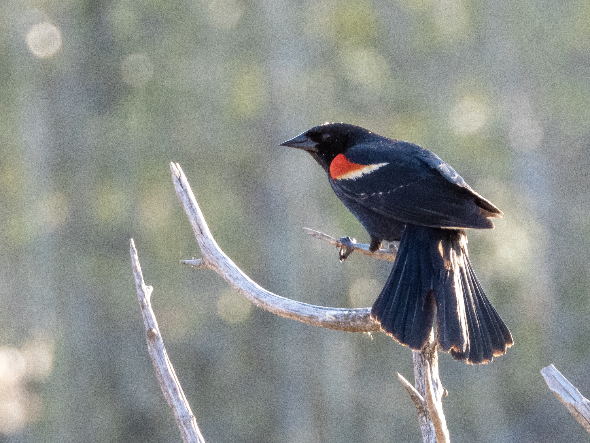

What is Project 366? Read more [here](https://thebirdsarecalling.com/2019/03/29/project-366/)!

The Red-winged Blackbirds ([Agelaius phoeniceus](https://ebird.org/species/rewbla)) have been back from their southern wintering grounds for quite some time now, but more and more of them seem to be appearing by the day. During my last visit at the Heritage Wetland Park in Sherwood Park their distinctive metal clanging vocalizations reverberated all over the wetland. I tried to keep a tally of their numbers but I gave up when I reached 30 and instead focused my attention on the other species that were there. While the male blackbirds were very abundant, there was a smaller number of females around as well. This was the first time I have seen female Red-winged Blackbirds. They have the same overall size and shape as the males, but none of the colours. Instead they are brown streaked and almost look like enormous sparrows. Their behaviour differs as well. While the males tend to perch on exposed high locations in the reed or on tree branches vocalizing and showing off, the females only seemed to be hanging out inside the reeds, occasionally coming out into the top level of the reeds. They seemed to check out the situation and then quickly dive back into the cover of the reeds again.

_May the curiosity be with you. This is from “The Birds are Calling” blog ([www.thebirdsarecalling.com](http://www.thebirdsarecalling.com)). Copyright Mario Pineda._
