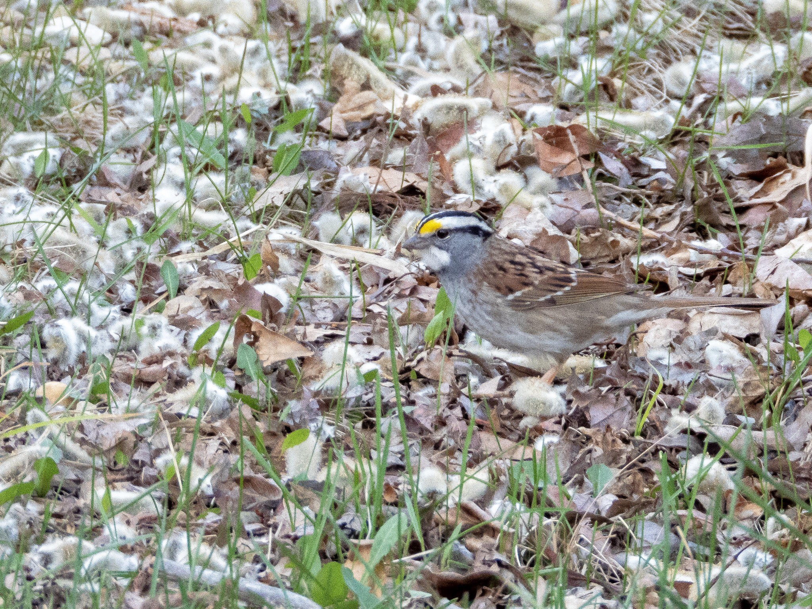

What is Project 366? Read more [here](https://thebirdsarecalling.com/2019/03/29/project-366/)!

The White-throated Sparrow (_[Zonotrichia albicollis](https://ebird.org/species/whtspa)_) has been at the top of my bird wish list ever since I embarked on this journey in December. After signing up for eBird I set up a rare bird email alert. The number of alerts I received throughout the winter were few and far in-between, but there are two particularly notable alerts. The first one was a heron sighting in Hermitage Park in mid-February. Sadly, but not surprisingly, subsequent sightnings suggests that it did not make it though the winter. The second memorable alert actually consisted of a series of intermittent alerts of White-throated Sparrow sighting. Their normal wintering grounds are a few thousand kilometres south-east of here, in the southern and eastern United States along the Atlantic and Gulf of Mexico coast. For some reason, however, every few weeks or so through the winter the odd individual was spotted in or around Edmonton. Sightings like these during the brutal central Alberta winter are extraordinary and rise many questions. Why did they stay behind? Were they lost? Did they make it through the winter? This unassuming sparrow is subtly beautiful with its black and white striped head, yellow lores (the area between the eye and the bill on the side of the head) and a white patch under its bill. It almost looked like a dolled up house sparrow. I spotted this lovely looking fellow (not sure if it a male or female) in the brush along the trail in Heritage Wetland Park in Sherwood Park.

_May the curiosity be with you. This is from “The Birds are Calling” blog ([www.thebirdsarecalling.com](http://www.thebirdsarecalling.com)). Copyright Mario Pineda._
