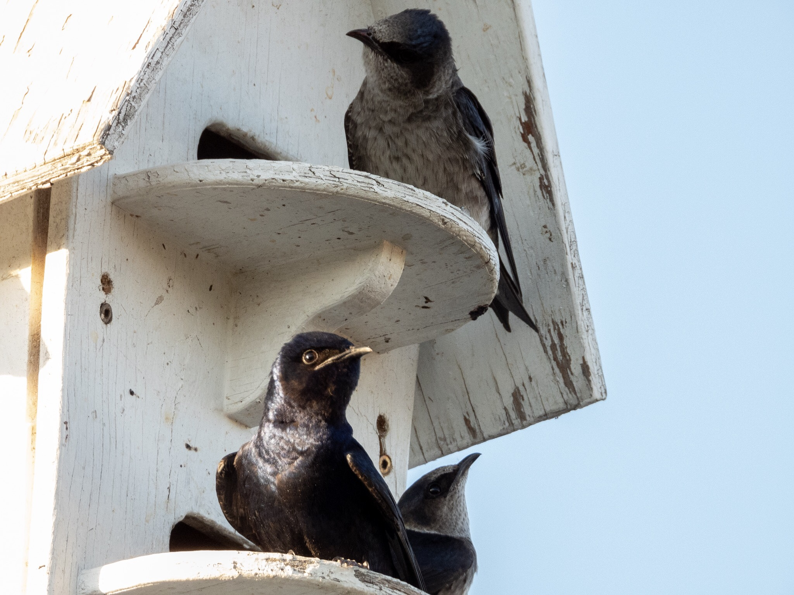

What is Project 366? Read more [here](https://thebirdsarecalling.com/2019/03/29/project-366/)!

It is difficult imagining getting bored of watching birds. With 6 months and 2 days of birding under my belt in three different countries and on two continents every nature walk is like a box of chocolates; you never know what you will see. The diversity in appearance and behaviour seems never ending. Some birds are colourful, some have eccentric behaviours others have impressive physical attributes or perform remarkable physical feats. Then there are those birds that have style. They have brio. They are the Dany and Rusty (as in the [Ocean’s film series](https://en.m.wikipedia.org/wiki/Ocean%27s_(film_series))) of the birding world. Purple Martins ([_Progne subis_](https://ebird.org/species/purmar)[)](https://ebird.org/species/purmar) at Heritage Wetlands Park in Sherwood Park definitely belong to this last category. Here they occupy elaborate multi-story bird mansions that balance on tall stakes high above the reeds. When they are not enjoying the vistas from their lofty perches they skip back and forth over the ponds in agile death defying maneuvers.

_May the curiosity be with you. This is from “The Birds are Calling” blog ([www.thebirdsarecalling.com](http://www.thebirdsarecalling.com)). Copyright Mario Pineda._
