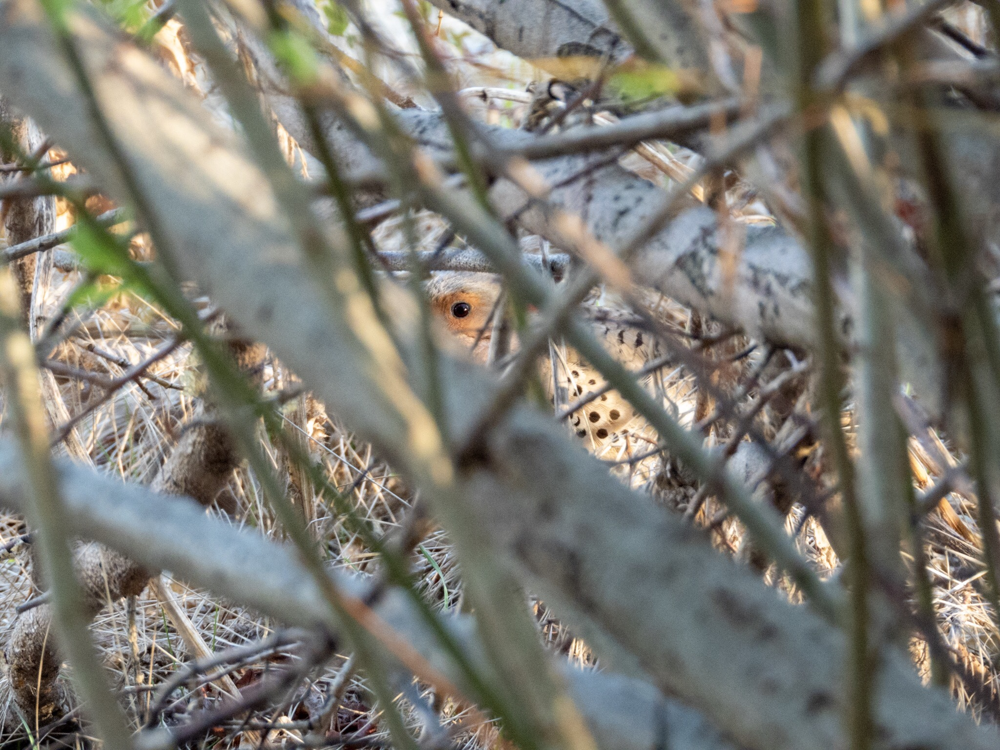

What is Project 366? Read more [here](https://thebirdsarecalling.com/2019/03/29/project-366/)!

I will be the first one to admit that this picture is a good candidate to post in the [Crap Bird Photography group on Facebook](https://m.facebook.com/groups/1516554791932973/) (and I will probably share it in that forum). There is more to the story, however, than just a picture of a bird through a jumble of branches. There is a tiny shallow side-pond at the Heritage Wetland Park in Sherwood Park. The pond is surrounded by thick brush and I had never bothered to look at it closely, partly because it is difficult to access through the thick understory and partly because I though it would be too puny for anything interesting to be there. The other day, as I was walking past it, I heard a symphony of croaking from the pond. I have not had much luck with spotting any amphibians to date, but I figure that my luck will never improve if I never try. Said and done. I found what appeared to me as a “weak spot” in the shrubbery and started to slowly make my way through the thick understory. As soon as the pond came within sight the croaking stopped abruptly. This is exactly the same story every time I try to sneak up on frogs. I found a tolerably comfortable spot by the side of the pond. Crouching in the thicket I made myself as comfortable as possible and decided to stay put for a bit so see if the frogs would relax and resume their business. As I was scanning along the water surface, the water’s edge and the shrubbery along the water with my camera I suddenly had to do a double take. In an impenetrable jumble of branches there was an eye looking right at me. I could see bits and pieces of the body of the critter and the pattern was unmistakable, it was a Northern Flicker (_[Colaptes auratus](https://ebird.org/species/norfli)_). It was completely still, not moving a single feather, staring intently at me. So there we were, staring each other down in a human vs bird staring contest. After what appeared like an unreasonable long time I came to my senses and realized that I should probably try to take some pictures, after all the camera had in some miraculous way focused in on the eye of the flicker without getting tricked by all the shrubbery between us. Finding a flicker skulking around on the ground is not uncommon as they are well-known to have a particular fondness for munching on ants.

Nikon P1000, 604mm @ 35mm, 1/60s, f/5, ISO 720. Postprocessed and cropped in Lightroom.

_May the curiosity be with you. This is from “The Birds are Calling” blog ([www.thebirdsarecalling.com](http://www.thebirdsarecalling.com)). Copyright Mario Pineda._
