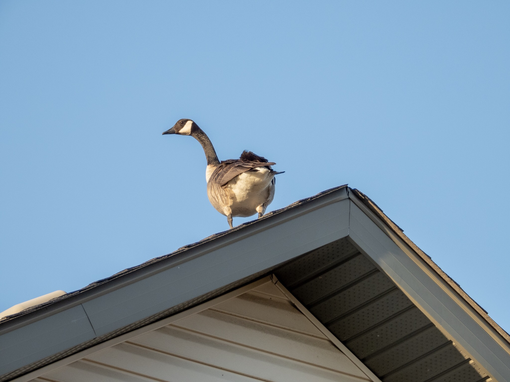

What is Project 366? Read more [here](https://thebirdsarecalling.com/2019/03/29/project-366/)!

Canada Geese are big birds with an even bigger attitude. There does not seem to be much that faze them. As probably one of the most common birds in these neck of the woods it easy to start ignoring them in favour of more exciting and uncommon birds. This fella, however, was out to make a statement that could not be ignored. Perched on the ridge of the roof of a large house overlooking the the Heritage Wetland Ponds, this Canada Goose was not lacking any self-confidence. I spend quit some time watching it and it seemed quite comfortable hanging out at its lofty and exposed perch. The only predators that could threaten an adult Canada Goose would be non-flying animals such as coyotes, cats (big cat, not your domestic kitty), foxes, dogs and humans. In other words, while this fella may be in an exposed location the biggest threat facing it would be inclement weather. Not on this day though, the sky was blue with not a cloud in sight and this goose was the king (or queen) of this roof.

Nikon P1000, 403mm @ 35mm, 1/200s, f/5, ISO 100. Postprocessed and cropped in Lightroom.

_May the curiosity be with you. This is from “The Birds are Calling” blog ([www.thebirdsarecalling.com](http://www.thebirdsarecalling.com)). Copyright Mario Pineda._
