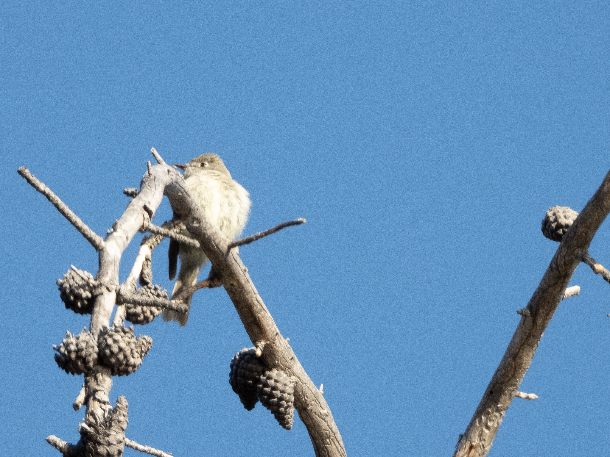

What is Project 366? Read more [here](https://thebirdsarecalling.com/2019/03/29/project-366/)!

My first flycatcher turned out to be a tricky nut to crack. I spotted it at the top of a dead spruce along the Athabaskan River along the old Ice Fields Parkway in Jasper National Park. Right from the get go I had no idea what I was looking at. I knew that the species was new to me and since I was nit even able to place it in a bird category, e.g. sparrows, finches, black birds, etc, I knew that this was something big. As I had not hope of identifying the bird in the field I focused on getting photographs of it from as many angles as possible. Fortunately it was a sunny day and the bird was perched in full sunlight, so I was able to get some decent pictures of it. Later on after the usual consultations with Merlin and Sibley it appeared that I had a flycatcher at my hands from the genus Empidonax. Flycatchers are small insect eating birds with many species looking similar. Sometimes positive identification is only possible based range, behaviour or vocalizations. My flycatcher is most likely a Hammond’s Flycatcher (_[Empidonax hammondii](https://ebird.org/species/hamfly)_, Life: #155, AB Big Year: #106).

Nikon P1000, 806mm @ 35mm, 1/500s, f/5.6, ISO 250.

_May the curiosity be with you. This is from “The Birds are Calling” blog ([www.thebirdsarecalling.com](http://www.thebirdsarecalling.com)). Copyright Mario Pineda._
