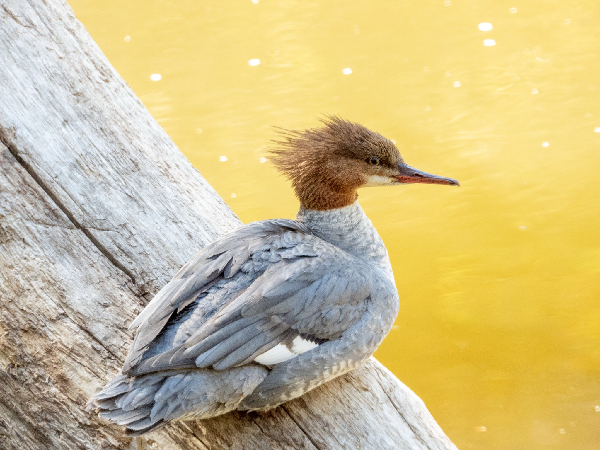

What is Project 366? Read more [here](https://thebirdsarecalling.com/2019/03/29/project-366/)!

Found this lovely Common Merganser ([Mergus merganser](https://ebird.org/species/commer)) down at the Whitemud Creek yesterday morning. There its was, just chilling on a log with its funky hairdo..., er, “featherdo”? If you look closely at the picture you can see the serrated edge of the bill. Mergansers eat fish so this helps them grip their prey. Sometimes they are referred to as sawbills. The famed naturalist and painter [John James Audubon](https://www.audubon.org/content/john-james-audubon) referred to these as Buff-breasted Merganser and Goosander in his 1827 book _The Birds of North America_. This particular merganser appeared to be alone and is likely either a non-breeding male or a female. Once males reach their breeding age (2 years) their appearance changes a black head and white body. Nonbreeding males and females are tricker to tell apart. None of the information online provided any clues as how to tell them apart. If in doubt, consult your [Sibley](https://www.sibleyguides.com/)! According to Sibley, adult nonbreeding males have a white stripe on their wing, which can clearly be seen in this picture. So there you have it folks, it’s a lonesome bachelor. Just a bit downstream there were several merganser couples swimming around romantically in the murky water. I guess this fella either did not get lucky this year or is not ready to commit, not that male merganser commit much as they do not help the female to care for the eggs or young.

Nikon P1000, 868mm @ 35mm, 1/125s, f/5.6, ISO 640.

_May the curiosity be with you. This is from “The Birds are Calling” blog ([www.thebirdsarecalling.com](http://www.thebirdsarecalling.com)). Copyright Mario Pineda._
