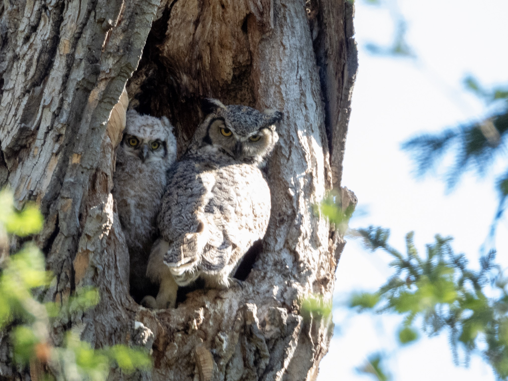

What is Project 366? Read more [here](https://thebirdsarecalling.com/2019/03/29/project-366/)!

I had never been down to the Whitemud Ravine in the morning before. Last Tuesday I was off from work and woke up early to a beautiful sunny morning. It was the perfect morning for a nature walk down by the creek. Said and done, at 7 am I started out down at the Snow Valley parking lot. Right off the bat, the birding kicked in at full gear with a bunch of Chipping Sparrows (_[Spizella passerina](https://ebird.org/species/chispa)_) hanging out in the trees by the parking lot. These were lifers for me and by playing their call through the Merlin App I had them sitting all around me in the trees curiously eyeing me. I can just imagine what must have been going though their bird brains, “Is this an intruder?” or “Is this a potential mate?”. That was a great start to a morning of some awesome birding. Other than two lifers, the highlight was definitely the Great Horned Owlets that were hanging out in their cavity. They were about 3 weeks old and getting quite large. By owl standards they would probably be considered teenagers. They sure behaved like teenagers, curious, oblivious to the dangers of the outside world, not following their owl parent instructions etc. There they were, perching precariously at the edge of the nest and ogling passersby. The sudden croaking of ravens directed their attention skywards. I am not sure if they would be aware of the dangers the ravens pose, but their parents definitely are. Dad, sitting in a nearby tree, started hooting and right away mom was inbound. She landed at the edge of the cavity pushing her owlets inside. The owlets had none of it as they tried to get past mom to check out what the commotion was about. Although the mother barely fit in the nest she blocked the entrance pushing her owlets back into the nest as she intently eyed the skies for the ravens. I spend well over an hour at the nest, snapping pictures and shooting videos of the chicks.

Nikon P1000, 1108mm @ 35mm, 1/200s, f/5.6, ISO 400.

Below is a video clip (13:16 min) of the action at the nest. Mom arrives at 7:32 and the person you can hear talking and shooting pictures in the background is Wayne Oaks, the resident Whitemud Ravine birding afictionado.

https://youtu.be/eLOY9yBpN0U

All in all, it was an amazing and beautiful morning full of birds, two of which were lifers (Chipping Sparrow and the American Goldfinch). I could have continued but after 3.5 hrs and 6 km my stomach started to grumble so it was time for a second breakfast and more coffee. This experience has opened my eyes to the virtues of early morning birding. The weekend cannot arrive soon enough.

Here is the eBird summary of the morning.

> Edmonton--Whitemud Park, Edmonton, Alberta, CA  
> May 21, 2019 7:07 AM - 10:37 AM  
> Protocol: Traveling  
> 6.341 kilometer(s)  
> 18 species  
>   
> Canada Goose (Branta canadensis)  5  
> Mallard (Anas platyrhynchos)  12  
> Green-winged Teal (Anas crecca)  2  
> Common Goldeneye (Bucephala clangula)  3  
> Common Merganser (Mergus merganser)  5  
> Great Horned Owl (Bubo virginianus)  4  
> Downy Woodpecker (Dryobates pubescens)  1  
> Pileated Woodpecker (Dryocopus pileatus)  1     Sound only  
> Common Raven (Corvus corax)  3  
> Black-capped Chickadee (Poecile atricapillus)  15  
> American Robin (Turdus migratorius)  4  
> House Finch (Haemorhous mexicanus)  1  
> American Goldfinch (Spinus tristis)  2  
> Chipping Sparrow (Spizella passerina)  3  
> Dark-eyed Junco (Junco hyemalis)  3  
> White-throated Sparrow (Zonotrichia albicollis)  1  
> Song Sparrow (Melospiza melodia)  2  
> Common Grackle (Quiscalus quiscula)  1

_May the curiosity be with you. This is from “The Birds are Calling” blog ([www.thebirdsarecalling.com](http://www.thebirdsarecalling.com)). Copyright Mario Pineda._
