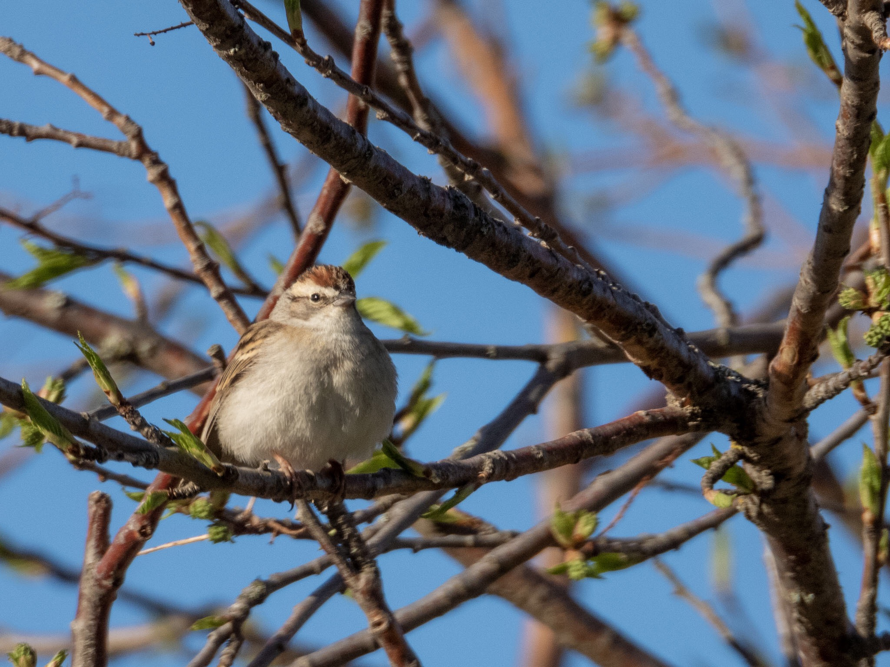

What is Project 366? Read more [here](https://thebirdsarecalling.com/2019/03/29/project-366/)!

The Chipping Sparrow ([_Spizella passerina_](https://ebird.org/species/chispa)[)](https://ebird.org/species/chispa) became lifer #158 and AB Big Year #109. It was a special find as this was the first time I did not finds the bird, but rather the bird found me. I was at the parking lot of Snow Valley on a sunny morning trying to get a good view of a bird sitting at the very top of the tallest spruce tree around singing its heart out. Because of the position of the bird and the bright light it was difficult to get a good view of its colour. Based on the size and over all shape I suspected a Dark-eyed Junco. I decided to try to identify it by its song, so I pulled up its audio file in the Merlin App to compare with the actual song. Within seconds after pressing play half a dozen small birds swooped in around me. They landed just a few meters from me in the trees, on the park bench and on a trash can. The suspected junco..., well, it flew of, go figure. The closest bird was definitely a house finch with its reddish head and neck and shoulders. The others were house sparrow sized and shaped but with a rust cap and black eye liner. It was a band of Chipping Sparrows and they were very curious about the large non-junco making junco sounds. So I guess one could say the Chipping Sparrow find was serendipitous. Birding with the Edmonton Nature Club I have seen birders playback bird calls in an attempt to attracts birds or bring them closer in. If used judiciously this appears to be an efficient trick turn the tables and instead of trying to sneak closer to the birds convince the birds to come closer to you.

_Nikon P1000, XXXmm @ 35mm, 1/Xs, f/X, ISO XXX._

_May the curiosity be with you. This is from “The Birds are Calling” blog ([www.thebirdsarecalling.com](http://www.thebirdsarecalling.com)). Copyright Mario Pineda._
